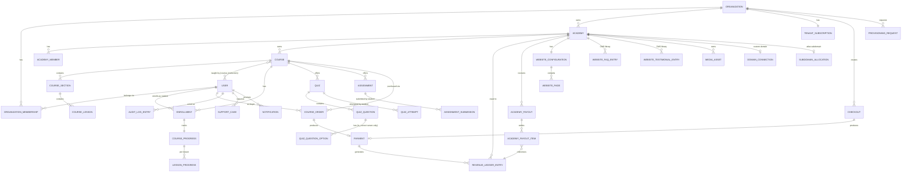
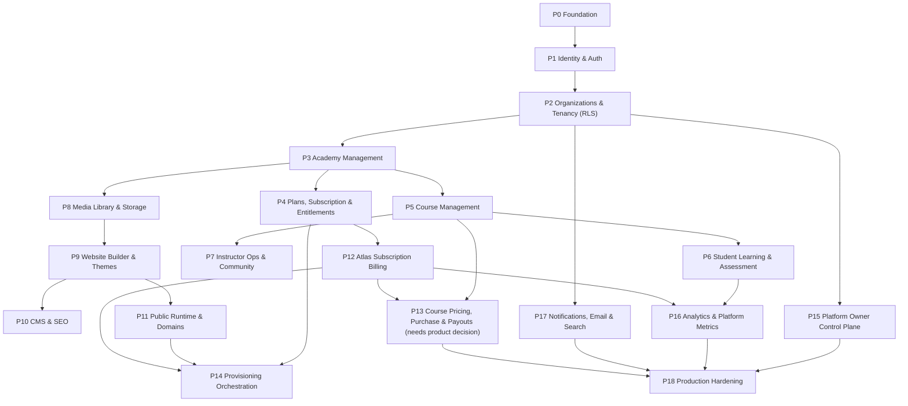

# ATLAS BACKEND MASTER PLAN

**Status:** Documentation only. No backend code, migrations, schemas, dependencies, or infrastructure exist as a result of this document.
**Scope:** The permanent, authoritative reference for Atlas backend architecture and implementation sequencing. A future session should be able to open this one file and implement any phase without rediscovering the architecture.
**Source of truth:** Direct inspection of the Atlas frontend repository — `src/types/` (45 files), `src/services/`, `src/features/*/services/`, `src/services/query/query-keys.ts`, `src/app/routes/`, `ATLAS_HANDOVER.md`, and `Reports/ARCHITECTURE.md` / `Reports/PROGRESS.md` / `Reports/ATOMS.md` — cross-checked against the previously published Atlas Backend Blueprint artifact. Where the repository is silent, this document says so explicitly rather than inventing a requirement.
**Golden rule:** the repository is the specification. A generic SaaS pattern is used only where the repository is genuinely silent, and every such case is marked `SPECIFICATION-UNDEFINED` or `PRODUCT DECISION REQUIRED` rather than decided quietly.

---

## How to use this document

- **New to the backend?** Read §1–§4, then §21 for the phase you're about to build.
- **Implementing a phase?** Read that phase's entry in §21, then the relevant domain subsections in §5 (database), §10 (API), §12 (jobs) it references. Do not re-derive architecture already decided in §25 (ADRs).
- **Designing payments?** §3, §4, and §23 are one connected argument — read them together, not in isolation.
- **Something looks undecided?** Check §24 before assuming. If it's not there either, it's a genuine new gap — add it to §24, don't silently resolve it.

---

## Table of contents

1. [What the Atlas backend is](#1-what-the-atlas-backend-is)
2. [Methodology](#2-methodology)
3. [Critical product decision — Course Pricing](#3-critical-product-decision--course-pricing)
4. [Payment business model](#4-payment-business-model)
5. [Complete database architecture](#5-complete-database-architecture)
6. [Entity relationship diagram](#6-entity-relationship-diagram)
7. [Multi-tenancy](#7-multi-tenancy)
8. [Authentication](#8-authentication)
9. [Authorization / RBAC](#9-authorization--rbac)
10. [API architecture](#10-api-architecture)
11. [Service architecture](#11-service-architecture)
12. [Events and background jobs](#12-events-and-background-jobs)
13. [Media storage](#13-media-storage)
14. [Analytics](#14-analytics)
15. [Search](#15-search)
16. [Security](#16-security)
17. [Database migration strategy](#17-database-migration-strategy)
18. [Testing strategy](#18-testing-strategy)
19. [Observability](#19-observability)
20. [Deployment architecture](#20-deployment-architecture)
21. [Backend implementation phases](#21-backend-implementation-phases)
22. [Backend prompt specification](#22-backend-prompt-specification)
23. [Course Pricing, Purchase & Revenue Architecture](#23-course-pricing-purchase--revenue-architecture)
24. [What must not be invented](#24-what-must-not-be-invented)
25. [Architecture Decision Records](#25-architecture-decision-records)
26. [Final architecture summary](#26-final-architecture-summary)

---

## 1. What the Atlas backend is

Atlas is a multi-tenant SaaS platform. An **Organization** (the SaaS tenant — `organizationId` is the sole tenant boundary, confirmed in `tenant.types.ts`'s own doc comment, no parallel `tenantId` exists anywhere) signs up and runs one or more **Academies**. Each Academy runs Course Management, Student Learning, Instructor Operations, Community content, and its own rented public **Website**. Atlas itself layers subscription billing and a Platform Owner Control Plane on top.

The backend's job is to be the one real system behind roughly 45 already-fully-specified frontend type files and their matching services — every domain in §5–§15 below has a live, typed, production-quality frontend contract waiting for it, verified line-by-line against the actual `src/` tree, not assumed from a generic SaaS shape.

**What the backend is not, by explicit repository rule, carried forward from every frontend prompt:** no Orders/Ecommerce beyond what's designed in §23, no live classes/video streaming/messaging, no AI features, no real auto-grading, no generic multi-purpose CMS framework, no second authorization model, no fake infrastructure status ever returned as "connected"/"active" without a real integration behind it.

---

## 2. Methodology

This document was produced by:

1. Re-reading `ATLAS_HANDOVER.md` in full (1177 lines) for the frontend's own account of its history, architecture, and explicitly-deferred scope.
2. Re-inspecting every relevant type file in `src/types/` (identity, tenant, academy, course, enrollment, progress, quiz, assignment, instructor, plan, money, checkout, payment, provisioning, domain, website*, media, notifications, search, audit-log, support, rbac, analytics, platform*) directly, not from memory of a prior summary.
3. Reading every service's `resource` path declaration across `src/features/*/services/*.ts` to confirm the actual REST resource shape the frontend already assumes.
4. Reading `src/services/query/query-keys.ts`'s `QUERY_KEY_ROOTS` for the complete list of distinct backend-facing domains the frontend maintains cache scoping for.
5. Reading `src/services/base.service.ts`, `src/services/api/api-client.ts`, and `src/config/env.config.ts` for the transport-level contract (verb mapping, collection envelope, error normalization, base URL convention).
6. Cross-checking every finding against the previously published Atlas Backend Blueprint (this session's own prior architecture analysis) for consistency — this document supersedes it as the permanent reference; the blueprint remains a valid artifact but this file is now authoritative.

Every claim below that cites a type or resource name is traceable to a real file under `src/`. Every place the repository is silent is marked explicitly rather than filled in with a generic default.

---

## 3. Critical product decision — Course Pricing

**This is not deferred to §23. It is stated here first because it is load-bearing for §4, §5, §10, §21, and §23 — skipping it produces a backend that can't actually sell a course.**

### What the frontend defines

`CoursePricing { type: 'free' | 'paid', amount?: number, currency?: string }` exists on every `Course` (`course.types.ts`). It is real, typed, and already rendered (`formatCoursePricing`) on `StudentCourseDetailsPage.tsx`.

### What the frontend does not define

Nothing gates enrollment on it. `EnrollmentService.createEnrollment({ courseId })` (`src/features/learning/services/EnrollmentService.ts`) is unconditional — confirmed by reading its only caller, `useEnroll.ts`, and the page that invokes it. `course.pricing` is read exactly once in `StudentCourseDetailsPage.tsx`, purely to build a display string. There is no `CourseOrder`, no `CoursePurchase`, no student-facing checkout for a course, and the existing Checkout/Payment engine's `CheckoutTargetType` union (`'plan_subscription' | 'add_on'`) has no course-shaped member at all.

### Why this matters more than any other gap in the specification

Every other domain in this document has a complete frontend contract to build against. Course Pricing has a **read-only display field with no backend behind it and no purchase flow connecting it to Enrollment.** This is the single largest hole between "what the frontend expects" and "what Atlas can actually sell." It must be resolved as a designed extension (§23), not discovered mid-implementation of Phase 13.

<a id="decision-course-pricing"></a>
> **PRODUCT DECISION REQUIRED:** the merchant-of-record model for course sales (§4) must be chosen before Phase 13 is scoped in detail. The data model in §5/§23 is designed to accommodate any of the three models in §4 without a later rebuild, but the *default behavior* (does a paid course silently block enrollment? does free stay instant?) needs product sign-off on the flow described in §23.

---

## 4. Payment business model

Atlas already runs exactly one real commercial flow: **an Organization buys Atlas** (`CheckoutService`/`PaymentService`, `organizationId`-scoped, manual bank/wallet transfer only today, a `gateway` method type reserved but unconnected). Course Pricing (§3) requires a second, structurally different flow: **a Student buys a course from an Academy.** These are not the same money flow and must not be modeled as one.

### Model A — Atlas as Merchant of Record (full custody)

| Aspect | Detail |
|---|---|
| Money flow | Student → Atlas's payment account (100%) → Atlas pays Academy on a schedule |
| Payment flow | One `Payment` per course order, provider is Atlas's own processor account, no per-academy processor account needed |
| Database impact | `course_orders`, `payments` (extended), `revenue_ledger_entries`, `academy_payouts` — no per-academy provider-account table needed |
| Payout flow | Manual or scheduled batch transfer (ACH/wire/manual) computed from the ledger; Atlas operations team executes or a job automates it against Atlas's own banking API |
| Refund flow | Refund reverses the ledger entry and (if already paid out) creates a payable adjustment against the Academy's next payout |
| Webhook implications | Only Atlas's own processor webhooks matter — one webhook consumer, not N |
| Compliance | Atlas alone carries PCI/KYC/tax-reporting burden for every course sold on the platform |
| Operational complexity | **Lowest to build first** — no Academy onboarding/KYC flow needed to launch |
| Scalability | Payout operations become a real operational liability past a small number of Academies unless automated early |
| Advantage | Fastest to ship; matches the existing single-processor-account shape of today's Atlas subscription billing |
| Disadvantage | Atlas owns 100% of chargeback/fraud/compliance risk for content it didn't produce; payouts are a manual liability until automated |

### Model B — Academy as Merchant of Record

| Aspect | Detail |
|---|---|
| Money flow | Student → Academy's own payment account directly; Atlas separately invoices the Academy for its platform fee |
| Payment flow | Each Academy connects/owns its own processor account and credentials |
| Database impact | `academy_payment_accounts` (external account references only, never raw credentials), `platform_fee_invoices` |
| Payout flow | None needed from Atlas's side — the Academy already has the money |
| Refund flow | Handled entirely within the Academy's own processor account, outside Atlas's ledger |
| Webhook implications | N processor accounts, N webhook relationships to maintain and verify |
| Compliance | Every Academy independently carries PCI/KYC/tax burden — a poor fit for a "rent your business in five minutes" pitch |
| Operational complexity | Highest — an onboarding/KYC flow per Academy, plus a second, separate platform-fee invoicing/collection flow |
| Scalability | Doesn't scale well operationally; two disconnected money flows (course revenue, platform fee) to reconcile |
| Advantage | Removes Atlas's own payment-processing liability entirely |
| Disadvantage | Weakest product experience (Academy Owners must set up their own merchant account before selling anything); worst reconciliation story |

### Model C — Marketplace / Connect / Split-payment

| Aspect | Detail |
|---|---|
| Money flow | Student → processor collects full price → processor automatically splits: platform fee to Atlas, remainder to the Academy's connected account |
| Payment flow | One `Payment` per course order; the provider adapter (already an architectural seam — `PaymentProviderAdapter`, `PaymentProviderRegistry`) performs the split at charge time |
| Database impact | `course_orders`, `payments` (extended with `academyId` + computed `platformFeeMinorUnits`), `academy_connected_accounts` (provider account reference + onboarding status only), `revenue_ledger_entries` |
| Payout flow | Automated by the processor (e.g. Stripe Connect's own payout scheduling) once the connected account is verified — Atlas doesn't move the money itself |
| Refund flow | Processor-native refund on a split payment automatically reverses both legs (platform fee and academy share) — the ledger entry is marked `refunded`, not deleted |
| Webhook implications | One processor relationship, richer event set (`account.updated`, `payout.paid`, in addition to `payment.*`) |
| Compliance | Processor (e.g. Stripe Connect) absorbs most KYC/PCI burden per connected account; Atlas's compliance surface is much smaller than Model B |
| Operational complexity | Medium — one Academy onboarding flow (connect account, verify identity) to build, but no manual payout operations |
| Scalability | Scales cleanly to thousands of Academies — payouts are automatic, not an operations queue |
| Advantage | Industry-standard shape for exactly this product (a platform selling many sellers' content); automated payouts remove the biggest long-term operational risk of Model A |
| Disadvantage | Requires choosing and integrating a Connect-capable processor before Phase 13 can be fully built; Academies must complete an onboarding/verification step before their courses can accept payment |

### Recommendation

**Model C (marketplace/split-payment), phased through Model A operationally for the first release.** Design the schema in §5/§23 with `academyId` and a computed `platformFeeMinorUnits` on every course-order `Payment` row from day one — this is the only piece that's expensive to retrofit later. Ship the *first* working version using Model A's simpler operational path (Atlas collects 100%, payout is a manually-triggered or simply-scheduled batch job against a ledger) so Phase 13 doesn't block on a Connect integration and Academy-onboarding flow being ready. Swap the payout *execution* mechanism to a real Connect adapter once one is integrated — the ledger/order/payment schema does not change, only which job pays out.

> **PRODUCT DECISION REQUIRED:** final confirmation of Model C as the target state, and approval of Model A as the interim bridge, must come from the product owner before Phase 13 begins. This document does not treat that confirmation as given.

### 4.1 FINALIZED PRODUCT DECISION (2026-08-26) — Two Coexisting, Organization-Chosen Modes

**This supersedes the single-model framing above as the authoritative decision.** Models A/B/C above are not wrong and are not deleted — they are the analysis that produced this decision, and remain the historical record of why it was made. The actual product decision is that Atlas does not force one merchant-of-record model on every Organization. Each Organization independently chooses one of two **payment collection modes**, recorded on the Organization itself (§5.8), applying uniformly to all of that Organization's Academies. The Academy has no independent billing identity in the current domain model, so the choice is not made — and is not overridable — per-Academy.

These are two distinct money-flow semantics, not two names for the same flow with a different provider plugged in:

| Mode | Money flow | Is Atlas a party to the funds? | Atlas commission applies? | Maps to §4's models |
|---|---|---|---|---|
| **A. Atlas Payments** | Student → Atlas-controlled payment infrastructure → Atlas commission retained → Organization proceeds routed onward | **Yes** — Atlas is the intermediary/custodian | Yes — per §4.2 | Model C (marketplace/split-payment), phased operationally through Model A exactly as ADR-011 already describes |
| **B. Organization-Owned Gateway** | Student → the Organization's own configured payment gateway → Organization | **No** — Atlas never custodies or routes the funds | No — there is nothing in Atlas's path to charge a commission on | A simplified Model B — **without** Model B's separate `platform_fee_invoices` flow, because no Atlas fee is owed in this mode at all |

**Why not force one model:** an Organization that already runs its own merchant account (Model B's advantage) must not be forced into Atlas's marketplace, while an Organization with no merchant account of its own must not be blocked from selling (Model C's advantage). Offering both, selected per-Organization, captures both advantages without contradicting either.

**Scope note:** which mode an Organization is in only changes *how a future course payment is routed once P13 exists* — selecting a mode does not itself implement course checkout, orders, or payouts. The configuration schema/architecture this decision requires (§5.8, §11.x) is the prerequisite Atlas is building ahead of P13, per explicit scope control; no order/checkout/ledger/payout table is introduced by this decision.

**No mode selected — explicit blocked state, never a silent default:** an Organization's payment-collection mode is a three-valued configuration — `unconfigured` (the real default every Organization starts in), `atlas_payments`, or `organization_gateway` — never a nullable field silently treated as one mode or the other. While `unconfigured`, paid-course checkout (P13) must refuse to proceed and surface an explicit "payment setup incomplete" configuration-required state to the Organization/Platform Owner, never silently fall back to Atlas Payments or any other mode.

> **PRODUCT DECISION REQUIRED (resolved):** ADR-011's "final confirmation of Model C" is now confirmed **for Organizations that select Atlas Payments**. Organizations that select Organization-Owned Gateway operate outside Atlas's marketplace entirely, per Model B, minus its invoicing sub-flow (superseded — no invoicing exists because no fee is owed).

### 4.2 Atlas Commission — Configuration & Snapshot Rule

Applies only to Payments processed under Atlas Payments mode (§4.1). Organization-Owned Gateway payments never carry an Atlas commission — Atlas is not in that money path, structurally, not just by a zero-percent setting.

**Configuration hierarchy (Platform-Owner-controlled, read-only to Organizations):**

| Level | Who sets it | Values |
|---|---|---|
| Global default | Platform Owner | A percentage, stored in basis points (integer, matching §5's own minor-unit-integer money convention extended to percentages — never a float). **Explicitly unset at creation, by design** — this document does not invent or assume a number. |
| Organization override | Platform Owner only — never the Organization itself | One of: `default` (inherits the global value), `custom` (a specific percentage, Platform-Owner-entered), `exempt` (0%, an explicit state distinct from "the default happens to be 0") |

**Effective commission resolution (no silent fallback):** resolving the commission rate for an Atlas Payments transaction means: use the Organization's override if `custom` or `exempt`; otherwise use the global default if it has been set; **if the Organization is `default` and no global default has ever been configured, resolution fails** — Atlas Payments is not usable for that Organization until a Platform Owner sets an effective rate. There is no third fallback value. This is the concrete enforcement of "Atlas Payments must not become usable for an Organization until an effective commission configuration exists."

**Snapshot rule (financial-history invariant):** the effective commission percentage is resolved exactly once, at the moment a course-order Payment is created, from whatever the Organization's configuration is at that instant — then frozen onto the Payment row. A later Platform Owner change to the global default or an Organization's override **never** retroactively changes a past Payment's commission. This is the same "freeze at creation, never recompute from live state" discipline `CheckoutSnapshot` (§5.7) already established for pricing — commission is a second instance of the identical pattern, not a new one.

**Money/rounding discipline (extends §5's existing convention):** every commission and refund-reversal calculation is integer arithmetic on minor currency units only — `amount_minor_units × rate_basis_points / 10000`, using the smallest unit the relevant currency actually supports. Floating-point arithmetic is never used for any monetary or commission value anywhere in this flow. Where a percentage calculation produces a fractional minor unit, the result is rounded using a deterministic **round-half-up** rule — the same rounded value is reproducible from the same inputs on any replay (e.g. a reconciliation job), never a locale- or runtime-dependent float rounding.

**Refund reversal (proportional, ledger-based, never mutated in place):** a refund inserts a new `revenue_ledger_entries` row of type `commission_reversal`, computed as `snapshotted_commission_amount × (refund_amount_minor_units / original_amount_minor_units)`, using the same integer/round-half-up rule above. The original `sale`/`platform_fee` ledger entries and the Payment's frozen commission snapshot are never edited — the reversal is an additional, auditable row, matching §23's existing "the original `sale` entry is never mutated or deleted" rule for refunds generally.

**Gateway processing fees are a distinct, unrelated concern — deliberately not modeled here:** gateway processing fees are a provider-specific concern belonging to whichever `PaymentProviderAdapter` eventually handles a transaction (§11.x), not a field on the core commission model. This document does **not** define a gateway-fee percentage, a universal gateway-fee formula, or any gateway-fee column on `payments`/the ledger — doing so would hard-code an assumption about a provider that doesn't exist yet. For the initial product model, the Organization bears whatever gateway processing fees apply (student price is never marked up for them), and Atlas commission is calculated independently of them — the two are computed separately and never netted against each other in this schema. If a future integrated gateway's fee mechanics require a different treatment, that is a new, explicit product decision at integration time, not an extension of this rule.

---

## 5. Complete database architecture

**Primary database: PostgreSQL.** Justification is in `ADR-002` (§25) — summary: the actual data model reconstructed below is genuinely relational (multi-table transactions across Course→Enrollment→Payment are common), needs native Row-Level Security for tenant isolation (§7), and benefits from JSONB for the handful of fields that are legitimately semi-structured (website sections, audit context, notification metadata) without needing a second database for them.

**Conventions applied to every table below, not repeated per-entity:**
- `id`: UUID primary key, generated server-side (`gen_random_uuid()` or app-layer UUID v7 for time-sortability) — never a client-supplied id.
- `created_at`, `updated_at`: `timestamptz`, set by the database/ORM, never client-writable.
- Tenant-scoped tables carry `organization_id` and/or `academy_id` as real foreign-key columns, never inferred.
- Money is always `amount_minor_units bigint` + `currency char(3)` — never a float column, matching `Money { amountMinorUnits, currency }` verbatim.
- Status/lifecycle fields are Postgres `enum` types matching the frontend's own union types exactly (e.g. `course_status` = `'draft' | 'published' | 'archived'`) so the backend can never represent a state the frontend has no way to render.
- "No hard delete" domains (Academies, Organizations, CMS content, Media assets) get a `status` column with an `archived`/`suspended` terminal state instead of a `DELETE` capability — there is deliberately no delete endpoint for these, not just a discouraged one.

### 5.1 Identity

#### `users`
**Purpose:** one account per human, mirrors `CurrentUser`.
**Tenant scope:** platform (a user is not owned by one organization — they can belong to several via `organization_memberships`).
**Columns:** `id`, `email` (unique, citext), `password_hash`, `name`, `avatar_url`, `is_platform_owner boolean default false`, `preferences jsonb` (theme/language/notification channels — mirrors `UserPreferences`), `status user_account_status` (`active`/`invited`/`suspended` — matches `PlatformUserAccountStatus` exactly), `last_sign_in_at`, `created_at`, `updated_at`.
**Indexes:** unique on `email`; btree on `status`.
**Security:** `password_hash` and any future MFA secret column are never selectable through any serializer that also returns to the frontend — enforce via a dedicated "public projection" view/DTO, never trust "the frontend doesn't render it."

#### `refresh_tokens`
**Purpose:** rotating session tokens backing `TokenMetadata.refreshToken`.
**PK:** `id`. **FK:** `user_id → users.id`.
**Columns:** `token_hash` (never store the raw token), `device_label`, `expires_at`, `revoked_at`, `created_at`.
**Indexes:** btree on `(user_id, revoked_at)`; unique on `token_hash`.
**Security:** stored hashed (e.g. SHA-256) so a database leak alone doesn't yield usable tokens.

#### `password_reset_tokens`
**Purpose:** backs `PasswordResetRequest`/`PasswordResetConfirmation`.
**PK:** `id`. **FK:** `user_id → users.id`.
**Columns:** `token_hash`, `expires_at` (short-lived, e.g. 30–60 min), `used_at`.
**Indexes:** unique on `token_hash`.

### 5.2 Tenancy

#### `organizations`
**Purpose:** the SaaS tenant boundary. Mirrors `Organization`/`PlatformOrganizationSummary`.
**PK:** `id`. **Tenant scope:** is the tenant root.
**Columns:** `name`, `slug` (unique), `status organization_status` (`active`/`suspended`/`archived`), `owner_user_id → users.id`, `created_at`, `updated_at`.
**Indexes:** unique on `slug`; btree on `status`.
**Soft delete:** status-based, never hard-deleted.

#### `organization_memberships`
**Purpose:** join table, mirrors `OrganizationMembership`.
**PK:** `id`. **FK:** `organization_id → organizations.id`, `user_id → users.id`.
**Columns:** `role text` (flat string, matches `CurrentUser.roles`/`OrganizationMembership.role` — no catalog), `permissions text[]` (flat, matches `OrganizationMembership.permissions`), `is_primary boolean`, `joined_at`.
**Unique constraint:** `(organization_id, user_id)`.
**Indexes:** btree on `user_id` (fast "which orgs is this user in"), btree on `organization_id`.

#### `academies`
**Purpose:** mirrors `Academy`.
**PK:** `id`. **FK:** `organization_id → organizations.id`.
**Columns:** `name`, `slug` (unique), `description`, `logo_url`, `favicon_url`, `status academy_status` (`draft`/`active`/`suspended`/`archived`), `timezone`, `language`, `currency`, `contact_email`, `contact_phone`, `website_url`, `address jsonb` (mirrors `AcademyAddress`), `created_at`, `updated_at`.
**Indexes:** unique on `slug`; btree on `(organization_id, status)`.
**Security:** every downstream academy-scoped table's RLS policy resolves tenant ownership by joining through this table to `organization_id` — this is the one place that mapping lives.

#### `academy_members`
**Purpose:** mirrors `AcademyMember`.
**PK:** `id`. **FK:** `academy_id → academies.id`, `user_id → users.id`.
**Columns:** `role academy_member_role` (`owner`/`administrator`/`manager`/`instructor`/`staff` — matches `AcademyMemberRole` exactly), `status academy_member_status` (`active`/`inactive`/`pending`), `joined_at`.
**Unique constraint:** `(academy_id, user_id)`.

### 5.3 Academic

#### `course_categories`
**Purpose:** mirrors `CourseCategory`. **FK:** `academy_id`. **Columns:** `name`, `slug`, `description`. **Unique:** `(academy_id, slug)`.

#### `courses`
**Purpose:** mirrors `Course`.
**PK:** `id`. **FK:** `academy_id → academies.id`, `category_id → course_categories.id` (nullable).
**Columns:** `title`, `slug`, `description`, `short_description`, `thumbnail_url`, `status course_status` (`draft`/`published`/`archived`), `visibility course_visibility` (`public`/`private`), `pricing_type course_pricing_type` (`free`/`paid`), `pricing_amount_minor_units bigint` (nullable, only when paid), `pricing_currency char(3)` (nullable, only when paid), `published_at`, `created_at`, `updated_at`.
**Unique:** `(academy_id, slug)`.
**Indexes:** btree `(academy_id, status, visibility)` (the exact shape of a course-list query); btree `(status, visibility)` for the flat cross-academy `discoverCourses` endpoint.
**Note:** pricing is stored directly on `courses`, matching `CoursePricing`'s embedded shape — no separate `products` table, since one course is always exactly one sellable thing today (no bundles/variants anywhere in the spec).

#### `course_instructors`
**Purpose:** join table — the server-side source of truth for "which courses can this instructor teach," resolved fresh on every request, never client-trusted (a repeated, explicit frontend rule).
**PK:** `(course_id, user_id)`. **FK:** `course_id → courses.id`, `user_id → users.id`.
**Write capability:** none today. This table is populated only via seed/admin-only inserts (Phase P5) and by direct database access — no application-layer create/update/delete endpoint exists, and RLS itself carries only SELECT/INSERT policies (no UPDATE/DELETE at all, at the database level). A real assignment/removal endpoint is a recognized, deliberately deferred future capability, not an oversight — see §24 ("Course instructor assignment/removal") for the full decision record and what must be specified before it's built.

#### `course_sections`
**Purpose:** mirrors `CourseSection`. **FK:** `course_id`. **Columns:** `title`, `description`, `order int`. **Indexes:** btree `(course_id, order)`.

#### `course_lessons`
**Purpose:** mirrors `CourseLesson`. **FK:** `section_id → course_sections.id`, denormalized `course_id` for direct scoping without a join.
**Columns:** `title`, `description`, `order int`, `content_type lesson_content_type` (`text`/`video`/`file`), `content_url`, `status lesson_status` (`draft`/`published`).
**Indexes:** btree `(section_id, order)`.
**Note:** `content_type = 'video'` with only a `content_url` column is a direct carry-over of the frontend gap flagged in §4 of the Backend Blueprint — see §12/§13 for the upload pipeline this implies is still undesigned for video specifically.

#### `enrollments`
**Purpose:** mirrors `Enrollment`. Student-self-scoped — every query resolves `student_id` from the authenticated session, never a request parameter.
**PK:** `id`. **FK:** `student_id → users.id`, `course_id → courses.id`, denormalized `academy_id` (mirrors the frontend's own denormalization, added "so learning pages reach academy-scoped Course endpoints without an academy id in the student-facing URL").
**Columns:** `status enrollment_status` (`available`/`pending`/`enrolled`/`completed`/`unavailable`), `enrolled_at`, `completed_at`.
**Unique:** `(student_id, course_id)`.
**Indexes:** btree `(student_id, status)`.

#### `course_progress`
**Purpose:** a materialized summary row per enrollment — mirrors `CourseProgress`. Computed/updated transactionally by the backend on every state change that affects it (lesson completed, quiz passed, assignment graded), never lazily derived on read.
**PK:** `enrollment_id → enrollments.id` (1:1). **Columns:** `total_lessons int`, `completed_lessons int`, `percentage numeric(5,2)`, `current_lesson_id`, `completion_state course_completion_state` (`incomplete`/`in_progress`/`completed`), `certificate_status certificate_status` (`unavailable`/`eligible`).

#### `lesson_progress`
**Purpose:** mirrors `LessonProgress`, per-lesson row. **FK:** `enrollment_id`, `lesson_id`. **Columns:** `status lesson_progress_status` (`locked`/`available`/`in_progress`/`completed`), `completed_at`. **Unique:** `(enrollment_id, lesson_id)`.

### 5.4 Assessment

#### `quizzes`
**Purpose:** mirrors `Quiz`. **FK:** `course_id`, `section_id` (nullable). **Columns:** `title`, `description`, `status quiz_status` (`draft`/`published`), `passing_score int` (nullable), `max_attempts int` (nullable = unlimited).

#### `quiz_questions`
**Purpose:** mirrors `QuizQuestion`. **FK:** `quiz_id`. **Columns:** `prompt`, `type quiz_question_type` (`single_choice`/`multiple_choice`/`true_false`), `order int`.

#### `quiz_question_options`
**Purpose:** mirrors `QuizQuestionOption` **plus** the one field the frontend structurally never receives: `is_correct boolean`.
**FK:** `question_id`. **Columns:** `label`, `is_correct`.
> **Security-critical, non-negotiable:** any API serializer that returns quiz questions to a student *before* they submit an attempt must project this table without the `is_correct` column — enforce with a dedicated read DTO/view, never a field-level "just don't render it" convention. See §16, §18's mandatory test.

#### `quiz_attempts`
**Purpose:** mirrors `QuizAttempt`. **FK:** `quiz_id`, `student_id → users.id`.
**Columns:** `status quiz_attempt_status` (`not_started`/`in_progress`/`submitted`/`passed`/`failed`), `answers jsonb` (array of `{questionId, selectedOptionIds}` — matches `QuizAnswer[]` exactly; kept as JSONB rather than a normalized table because it's write-once-then-read-only per attempt, never queried by individual answer), `score numeric(5,2)`, `passed boolean`, `submitted_at`, `attempt_number int`.
**Indexes:** btree `(student_id, quiz_id, attempt_number)`.

#### `assignments`
**Purpose:** mirrors `Assignment`. **FK:** `course_id`, `section_id` (nullable), `lesson_id` (nullable). **Columns:** `title`, `description`, `instructions`, `status assignment_status`, `due_at`, `allow_resubmission boolean`.

#### `assignment_submissions`
**Purpose:** mirrors `AssignmentSubmission` + `Grade` (frontend keeps these as one entity from the instructor's view, `AssignmentSubmissionReview`).
**FK:** `assignment_id`, `student_id → users.id`.
**Columns:** `status submission_status` (`draft`/`submitting`/`submitted`/`failed`), `response text`, `attachment_url`, `submitted_at`, `grading_status` (`ungraded`/`graded`), `score numeric(5,2)`, `feedback text`, `graded_at`, `graded_by → users.id`.
**Unique:** `(assignment_id, student_id)` unless `allow_resubmission` — if resubmission is allowed, keep the latest row and store prior attempts in an append-only `assignment_submission_history` table (only add this table when Phase 6 discovers resubmission history is actually needed for grading UX; not built speculatively now).

### 5.5 Community

#### `announcements`
**FK:** nullable `academy_id`, nullable `course_id` (exactly one of the two, or neither for platform-wide — matches `AnnouncementAudience` exactly). **Columns:** `audience announcement_audience`, `author_id → users.id`, `title`, `body`, `status announcement_status`, `scheduled_at`, `published_at`.

#### `blog_posts`
**FK:** nullable `academy_id` (absent = platform-level). **Columns:** `author_id`, `title`, `slug`, `excerpt`, `content text`, `featured_image_url`, `category`, `tags text[]`, `status blog_post_status`, `published_at`. **Unique:** `(academy_id, slug)`.
> **Naming note carried from the frontend:** this is the dynamic, permission-gated Knowledge Blog (`@features/blog`), structurally distinct from the pre-existing static marketing blog served from prerendered content — do not conflate the two when naming backend resources.

#### `forums`, `forum_threads`, `forum_replies`
One forum per course (`forums.course_id` unique). Threads/replies mirror `ForumThread`/`ForumReply` exactly, including `pinned`/`locked` booleans.

### 5.6 SaaS Foundation (Plans / Subscriptions)

#### `plans`
**Purpose:** catalog entity, platform-owned, mirrors `Plan`. **Columns:** `key` (unique, stable), `name`, `description`, `status plan_status` (`active`/`archived`), `display_order int`, `limits jsonb` (mirrors `PlanResourceLimits` — 7 fields, each `int` or the literal `'unlimited'`), `features jsonb` (mirrors `PlanFeatures` — 11 booleans), `pricing jsonb` (mirrors `PlanPricingMetadata`, display-only).

#### `add_ons`
**Purpose:** catalog entity, mirrors `AddOn`. **Columns:** `key` (unique), `name`, `description`, `effect jsonb` (mirrors the `AddOnLimitEffect`/`AddOnFeatureEffect` discriminated union), `compatible_plan_keys text[]`, `pricing jsonb`.

#### `tenant_subscriptions`
**PK:** `organization_id` (1:1). **FK:** `plan_id → plans.id`. **Columns:** `status tenant_subscription_status` (7-state enum matching `TenantSubscriptionStatus` exactly), `trial_ends_at`, `grace_ends_at`, `current_period_start`, `current_period_end`, `cancel_at_period_end boolean`, `billing_cycle` (nullable).

#### `tenant_add_ons`
**FK:** `organization_id`, `add_on_id`. **Columns:** `activated_at`. **Unique:** `(organization_id, add_on_id)`.

#### `tenant_usage`
**Purpose:** mirrors `TenantUsage` — a computed/cached row, refreshed by a scheduled job (§12), never computed live on every dashboard read.
**PK:** `organization_id`. **Columns:** one `used int` per `UsageMetric` (`academies`, `students`, `instructors`, `staff`, `courses`, `general_storage_gb`, `video_storage_gb`), `updated_at`.

#### `trial_policy`
**Purpose:** singleton platform configuration, mirrors `TrialPolicy`. **Columns:** `enabled boolean`, `duration_days int`. Exactly one row ever exists.

### 5.7 Commerce — Atlas subscription billing

#### `checkouts`
**Purpose:** mirrors `Checkout`. **FK:** `organization_id`. **Columns:** `target_type` (`plan_subscription`/`add_on`), `target_key text`, `billing_cycle`, `snapshot jsonb` (frozen `CheckoutSnapshot`, written once, never updated), `status checkout_status` (`draft`/`pending_payment`/`completed`/`expired`/`cancelled`), `expires_at`, `idempotency_key`.
**Unique:** `(organization_id, idempotency_key)` — the exact constraint that makes a retried `createCheckout` call safe.

#### `payments`
**Purpose:** mirrors `Payment` — the provider-agnostic core. One shape for manual and gateway payments, never two parallel tables (matches the frontend's own explicit "one Payment shape" rule).
**FK:** `checkout_id` (nullable — see §23 for the course-order extension), `organization_id` (nullable once course payments exist — see note below).
**Columns:** `method_key`, `method_type payment_method_type` (`manual_bank_transfer`/`manual_wallet_transfer`/`gateway`), `provider text`, `amount_minor_units bigint`, `currency char(3)`, `status payment_lifecycle_status` (9-state enum matching `PaymentLifecycleStatus` exactly), `review_status manual_review_status` (`not_required`/`pending`/`approved`/`rejected`), `failure_reason`, `review_notes`, `next_action jsonb`, `provider_reference`, `expires_at`, `created_at`, `updated_at`.
> **Extension point for §23:** `organization_id` becomes nullable and two new nullable columns are added — `payer_user_id` and `payee_academy_id` — so the same table serves both money flows without a parallel `course_payments` table. A `CHECK` constraint enforces exactly one of `(organization_id)` or `(payer_user_id, payee_academy_id)` is populated per row, keeping the two flows structurally distinguishable even though they share a table.

#### `payment_attempts`
**FK:** `payment_id`. **Columns:** `status payment_attempt_status`, `provider_reference`, `failure_reason`.

#### `payment_proofs`
**FK:** `payment_id`. **Columns:** `file_name`, `file_url` (private, signed-URL access only — never a public asset path), `mime_type`, `note`, `uploaded_at`.

#### `payment_reviews`
**FK:** `payment_id`, `reviewed_by → users.id`. **Columns:** `status manual_review_status`, `notes`, `reviewed_at`.

#### `tenant_invoices`
**FK:** `organization_id`, nullable `payment_id`. **Columns:** `number` (unique), `status invoice_status` (`draft`/`issued`/`paid`/`void`), `amount_minor_units`, `currency`, `issued_at`, `due_at`, `paid_at`.

### 5.8 Commerce — Course purchase & revenue (new, per §23)

#### `course_orders`
**Purpose:** the commercial record of "a student wants to buy a course" — the course-purchase analog of `checkouts`. Deliberately its own table rather than overloading `checkouts`, because the scoping dimension is different (`student_id` + `course_id`, not `organization_id`).
**FK:** `student_id → users.id`, `course_id → courses.id`, denormalized `academy_id`. **Columns:** `snapshot jsonb` (frozen price + course title at order time — same "never recompute from a live catalog" rule as `CheckoutSnapshot`), `status course_order_status` (`draft`/`pending_payment`/`paid`/`expired`/`cancelled`/`refunded`), `expires_at`, `idempotency_key`, `created_at`.
**Unique:** `(student_id, idempotency_key)`.

#### `revenue_ledger_entries`
**Purpose:** the append-only, immutable record of every money movement tied to a course order — never updated in place, only ever inserted (a refund is a new negative-amount entry referencing the original, not a mutation of it).
**FK:** `payment_id`, `academy_id`, `course_order_id`. **Columns:** `entry_type` (`sale`/`platform_fee`/`refund`/`payout`), `amount_minor_units bigint` (signed), `currency`, `occurred_at`.
**Indexes:** btree `(academy_id, occurred_at)` — this is the query Academy Revenue reporting runs against.

#### `academy_payouts`
**FK:** `academy_id`. **Columns:** `status payout_status` (`pending`/`processing`/`paid`/`failed`), `amount_minor_units`, `currency`, `period_start`, `period_end`, `paid_at`, `provider_reference` (nullable — populated once a real Connect-style payout exists; null under the Model-A manual bridge).

#### `academy_payout_items`
**Purpose:** line-item detail per payout, linking it back to the ledger entries it settles — required for reconciliation.
**FK:** `payout_id`, `revenue_ledger_entry_id`.

#### `academy_connected_accounts`
**Purpose:** only populated once a real Model-C processor integration exists (§4) — reference only, never raw banking credentials.
**FK:** `academy_id` (unique — one connected account per academy). **Columns:** `provider text`, `provider_account_id`, `onboarding_status` (`not_started`/`pending`/`verified`/`restricted`).
> **Superseded by §4.1 (2026-08-26):** the custodial/onboarding relationship for Atlas Payments is Organization-level, not Academy-level (`organization_connected_accounts`, below) — the Organization is the entity that chooses a payment collection mode and the entity a real Connect-style processor would onboard. This table's original Academy-scoped shape does not get built; kept here only as the historical record of the pre-decision design. Per-Academy revenue attribution is unaffected — `revenue_ledger_entries` still denormalizes `academy_id` for reporting (unchanged).

#### `organization_payment_settings` *(new, §4.1 — prerequisite to Phase 13, not itself a Course Commerce table)*
**Purpose:** which of the two §4.1 modes an Organization has chosen.
**FK:** `organization_id` (unique — one row per Organization).
**Columns:** `payment_collection_mode` (`unconfigured` / `atlas_payments` / `organization_gateway` — three explicit values, never nullable-as-a-mode; every Organization starts `unconfigured`), `created_at`, `updated_at`.

#### `organization_gateway_credentials` *(new, §4.1)*
**Purpose:** an Organization's own gateway configuration, for Organization-Owned Gateway mode.
**FK:** `organization_id` (unique — one active own-gateway configuration per Organization, matching the dashboard's single "Online Gateway" selector, not a list).
**Columns:** `provider_key` (references the `PaymentProviderRegistry`'s registered keys, §11.x — not an open string), `status` (`not_configured`/`configured`/`verified`/`disabled`), `encrypted_config` (application-layer envelope-encrypted before storage, §16 — never plaintext, never selected on any response path), `enabled boolean`, `last_tested_at`, `last_test_result jsonb` (provider-agnostic success/failure summary, never a raw provider error payload), `created_at`, `updated_at`.
**Security:** no repository method used on a read/response path ever selects `encrypted_config` — a separate, internal-only accessor is used exclusively inside the resolved adapter at call time (§16).

#### `organization_connected_accounts` *(new, §4.1 — the Organization-level replacement for the superseded `academy_connected_accounts` role above)*
**Purpose:** an Organization's Atlas Payments custodial/onboarding relationship.
**FK:** `organization_id` (unique).
**Columns:** `provider_key` (the Atlas-side marketplace processor, once one is integrated — unset today), `external_account_reference` (the provider's own account id — never a credential), `onboarding_status` (`not_started`/`pending`/`action_required`/`verified`/`restricted`/`disabled`), `payouts_enabled boolean`, `created_at`, `updated_at`.

#### `organization_commission_settings` *(new, §4.2)*
**Purpose:** the Organization-level commission override described in §4.2.
**FK:** `organization_id` (unique).
**Columns:** `commission_mode` (`default`/`custom`/`exempt`), `custom_percentage_basis_points int` (nullable, populated only when `commission_mode='custom'`), `updated_by → users.id` (the Platform Owner who last changed it), `created_at`, `updated_at`.
**RLS:** Organizations get a narrow `SELECT`-only policy on their own row (visibility only); no `INSERT`/`UPDATE`/`DELETE` policy exists for the tenant role — only the Platform-Owner path (`is_platform_owner`, §7/§16) can write it, mirroring P11's `PlatformDomainController` write-gate precedent exactly. This is the concrete enforcement of "an Organization must not be able to grant itself a commission exemption or modify its own rate."

#### `atlas_commission_config` *(new, §4.2)*
**Purpose:** the platform-wide global default commission from §4.2.
**Cardinality:** singleton — the same "no natural single-row DB constraint for a Prisma model" pattern already used for `TrialPolicy` (§5.4), enforced identically (a fixed well-known id / partial unique index), not a new mechanism.
**Columns:** `default_commission_basis_points int` (**nullable — deliberately unset at creation**; this document does not invent a value here), `updated_by → users.id`, `updated_at`.
**RLS:** platform-infrastructure table, no tenant RLS — same category as `Plan`/`AddOn`/`PaymentMethod`, write-gated to Platform Owner at the application layer.

#### Course Commerce extension point *(documents §23's future shape — not built in this phase)*
When P13 builds the extended `payments` row for course orders (§5.7's "Extension point for §23"), it additionally carries, frozen at creation per §4.2's snapshot rule and never recomputed: `payment_collection_mode_snapshot`, `commission_rate_basis_points_snapshot`, `commission_amount_minor_units`. No gateway-fee field is added here — per §4.2, gateway fees are a provider-adapter concern, not a core-schema field. `revenue_ledger_entries.entry_type` (above) gains one additional value at that time, `commission_reversal`, for the proportional-refund rule in §4.2.

### 5.9 Media

#### `media_assets`
**Purpose:** mirrors `MediaAssetSummary`/`Detail` exactly.
**FK:** `academy_id`. **Columns:** `type media_asset_type` (`image`/`video`/`document`/`other`), `status media_asset_status` (`active`/`archived` — no hard delete), `file_name`, `storage_key` (the object-storage key, never the public URL alone — lets the URL/CDN domain change without a data migration), `url`, `alt_text`, `mime_type`, `size_bytes bigint`, `width int` (nullable), `height int` (nullable), `created_at`.
**Indexes:** btree `(academy_id, status, type)`.

### 5.10 Website / CMS

#### `website_configurations`
**Purpose:** mirrors `WebsiteConfiguration` — always the current draft working copy. **PK:** `academy_id` (1:1). **Columns:** `theme_key`, `theme_version int`, `config_version int`, `brand jsonb`, `seo jsonb`, `navigation jsonb`, `header jsonb`, `footer jsonb`, `status website_publish_status` (`draft`/`published`/`publishing`/`failed`), `published_at`, `last_publish_error jsonb`.

#### `website_pages`
**FK:** `academy_id`. **Columns:** `page_type` (`core`/`custom`), `core_type` (nullable, one of the 6 `WebsiteCorePageType` values), `title`, `slug`, `visible boolean`, `seo jsonb`, `sections jsonb` (the full `SectionInstance[]` array — kept as validated JSONB, not normalized per-section, because sections are read/written atomically as one page save, never queried individually). **Unique:** `(academy_id, slug)`.
> **Security-critical:** every write to `sections` must be validated server-side against the exact discriminated-union shape (`SectionType` → its matching `SectionConfigMap` entry) the frontend enforces — reject anything that doesn't match a registered section type's config shape. This is the real stored-content-injection boundary (§16).

#### `website_faq_entries`, `website_testimonial_entries`
**FK:** `academy_id`. **Columns:** localized fields as `jsonb` matching `LocalizedText { en, ar }` exactly, `order int`, `visible boolean`, `status website_content_status` (`draft`/`published`/`archived` — archive is the only removal, no hard delete).

### 5.11 Infrastructure

#### `provisioning_requests`
**FK:** `organization_id`, nullable `academy_id` (populated once the `academy` step completes). **Columns:** `status provisioning_status` (12-value enum matching `ProvisioningStatus` exactly), `current_step_key`, `subdomain jsonb`, `domain jsonb`, `idempotency_key`, `attempt_count int`, `requested_academy_name`, `requested_subdomain`, `triggering_payment_id` (nullable), `last_error jsonb`, `started_at`, `completed_at`, `failed_at`.

#### `provisioning_steps`
**FK:** `provisioning_request_id`. **Columns:** `key provisioning_step_key` (7-value enum), `status provisioning_step_status` (`pending`/`running`/`completed`/`failed`/`skipped`), `attempt_number int`, `started_at`, `completed_at`, `failed_at`, `error jsonb`.
**Unique:** `(provisioning_request_id, key)` — one row per step per request, updated in place as it progresses (unlike the ledger, this is genuinely mutable state, not an append-only log).

#### `subdomain_allocations`
**FK:** `academy_id` (unique). **Columns:** `subdomain` (unique), `status subdomain_status`, `full_host`.

#### `domain_connections`
**FK:** `academy_id` (unique). **Columns:** `hostname` (unique, nullable), `status domain_status` (7-value enum matching `DomainStatus` exactly), `verification_records jsonb`, `ssl_status`, `cdn_status`, `cdn_provider`, `connected_at`.

#### `platform_domain_configuration`
**Purpose:** singleton. **Columns:** `base_domain`, `configured boolean`, `updated_at`.

### 5.12 Platform

#### `audit_log_entries`
**Purpose:** append-only, backend-written-only (the frontend has no write path — every mutation across every other domain that's "auditable" writes here as part of its own transaction, not as an afterthought).
**FK:** `actor_user_id → users.id`, nullable `organization_id`. **Columns:** `action text` (dotted event name, e.g. `"organization.suspended"`), `target_type`, `target_id`, `target_label`, `context jsonb`, `occurred_at`.
**Indexes:** btree `(occurred_at desc)`, btree `(organization_id, occurred_at desc)`, btree `(target_type, target_id)`.

#### `support_cases`, `support_case_messages`
**FK (cases):** nullable `organization_id`, `requester_user_id`. **Columns:** `subject`, `status support_case_status` (4-state), `priority support_case_priority`, `assigned_to_name` (display-only, no agent-directory table exists per the frontend's own documented boundary).
**FK (messages):** `case_id`. **Columns:** `author_name`, `author_role` (`requester`/`agent`), `body`.

#### `notifications`
**FK:** `user_id`. **Columns:** `type notification_type` (6-value), `priority notification_priority`, `title_key`, `message_key`, `values jsonb`, `is_read boolean`, `action_url`, `action_label_key`, `metadata jsonb`.
**Indexes:** btree `(user_id, is_read, created_at desc)`.
> `title_key`/`message_key` are translation keys, not literal text — the backend never writes user-facing English/Arabic strings directly, matching the frontend's i18n architecture exactly.

#### `platform_settings`
**Purpose:** singleton, mirrors `PlatformConfiguration`. **Columns:** `platform_name`, `platform_description`, `support_email`, `two_factor_required boolean`, `session_timeout_minutes` (15/30/60/`null`=never).

#### `platform_metrics_snapshots`
**Purpose:** the computed, scheduled-job-populated backing for `PlatformMetricsOverview` (§14). **Columns:** the 7 KPI fields, `generated_at`. Only the latest row is read by the dashboard; older rows retained for trend computation.

#### `analytics_overview_snapshots`, `analytics_time_series_points`, `analytics_breakdowns`
**Purpose:** backing for `AnalyticsOverview`/`AnalyticsTimeSeries`/`AnalyticsBreakdown` (§14) — populated by scheduled aggregation, never computed live on the request path.

---

## 6. Entity relationship diagram



Every entity beneath `ORGANIZATION`/`USER` carries a tenant reference — directly (`organization_id`) or transitively (`academy_id → academies.organization_id`). `USER` and `ORGANIZATION` are the only roots with no tenant parent, matching the frontend's model exactly: Organization is the sole tenant boundary, and a user can belong to several organizations via membership.

---

## 7. Multi-tenancy

```
Platform (Atlas)
  ↓
Organization  (the tenant — organization_id)
  ↓
Academy  (the second-level scope — academy_id, transitively owned by one organization)
  ↓
Users / Courses / Enrollments / Content / Website / Media  (owned by one Academy, or directly by one Organization for org-level resources like billing)
```

### Resource ownership table

| Owned by Platform | Owned by Organization | Owned by Academy | Owned by User |
|---|---|---|---|
| Plans, Add-ons, Trial Policy, Platform Settings, Platform Metrics, Audit Log, Support cases | Organization membership, Tenant Subscription/Usage, Checkouts/Payments (Atlas billing), Provisioning Requests | Courses, Enrollments (denormalized), Website, Media, Domain, Academy Members, Announcements (academy-scoped), Blog, Forums | Profile/preferences, Refresh tokens, own Enrollments, own Quiz Attempts/Submissions, own Notifications |

### Enforcement, concretely

1. **Column-level**: every tenant-scoped table carries `organization_id` and/or `academy_id` directly (§5's convention) — never inferred from a join at query time as the *only* mechanism.
2. **Postgres Row-Level Security**: a policy on every tenant-scoped table, keyed to a session variable (`SET LOCAL app.current_organization_id = '<uuid>'`) populated once per request from the verified JWT — the database itself refuses to return another tenant's row even if application-layer scoping has a bug. This is the primary defense, not a backstop.
3. **Application-layer scoping is still mandatory**, not redundant — every repository method takes an explicit tenant context parameter, mirroring exactly how the frontend threads `organizationId`/`academyId` through every query key rather than relying on ambient global state.
4. **Platform Owner bypass is explicit, role-scoped, and audited** — a distinct database role/policy allowed to see across tenants, never RLS disabled globally. Every Platform Owner Control Plane query is logged to `audit_log_entries`.
5. **Composite indexes lead with the tenant column** — `(organization_id, created_at)`, `(academy_id, status)` — both for RLS query performance and because that's the real access pattern of every list endpoint.

### The concrete test this must pass (elaborated in §18)

A request authenticated as a member of Organization A, attempting to read, list, or write any row belonging to Organization B — by direct id, by a crafted filter, or by a list query — must fail with the correct 403/404, for every tenant-scoped table that exists. This suite starts the moment `organizations`/`academies` exist and grows with every later phase; it never shrinks.

---

## 8. Authentication

Backs `AuthenticationService`/`SessionService`/`TokenService`/`CurrentUserService` exactly.

| Capability | Design |
|---|---|
| Registration | `POST /auth/register {name, email, password}` — creates a `users` row, does **not** establish a session (matches `RegistrationRequest`'s frontend behavior of navigating to sign-in afterward, not auto-login) |
| Login | `POST /auth/sign-in` — verifies password (Argon2id), issues access JWT (5–15 min TTL) + refresh token (rotating, stored hashed in `refresh_tokens`) |
| Logout | `POST /auth/sign-out` — revokes the presented refresh token (`revoked_at`); does not invalidate other devices' sessions unless explicitly requested |
| Password hashing | Argon2id, tuned parameters per current OWASP guidance |
| Password reset | `POST /auth/password-reset/request {email}` → issues a `password_reset_tokens` row, sends email (§12); `POST /auth/password-reset/confirm {token, newPassword}` → validates, rotates password, invalidates the token and (recommended) all existing refresh tokens for that user |
| Email verification | `SPECIFICATION-UNDEFINED` — no verification step exists in `RegistrationRequest` or any registration flow today. Recommended default if approved: a verification-required flag on `users`, gating first sign-in, sent via the same email pipeline as password reset. **Do not build until confirmed** (§24). |
| Token rotation | Every refresh call issues a new refresh token and revokes the old one; concurrent refresh calls with the same (not-yet-revoked) token must be deduplicated safely — this exact concurrency case is why the frontend's `SessionService` already has dedup logic (a Prompt 2 hardening fix), and the backend's refresh endpoint must be safe under it, not just the frontend. |
| Token revocation | Sign-out revokes one token; a future "sign out of all devices" (frontend control exists but is disabled, per §24) revokes every `refresh_tokens` row for the user |
| Expiration | Access token TTL short and non-negotiable; refresh token TTL long (e.g. 30 days) but revocable at any time via the `revoked_at` column |
| Brute-force protection | Per-IP and per-account sliding-window rate limits on `/auth/sign-in` and `/auth/password-reset/request` (Redis-backed) |
| Account lockout | `SPECIFICATION-UNDEFINED` — no lockout state exists in `CurrentUser`/`PlatformUserAccountStatus` today (only `active`/`invited`/`suspended`, none of which is "temporarily locked from too many failed attempts"). Recommended default: rate limiting alone at first, formal lockout only if abuse patterns demand it. |
| Security events | Fold into `audit_log_entries` (sign-in, password change, password reset) rather than a separate table — one audit trail, not two |

---

## 9. Authorization / RBAC

**The frontend's actual model, verified directly in `authorization.service.ts`'s own doc comment and `rbac.types.ts`: flat `roles: string[]` + `permissions: string[]` on `CurrentUser`, checked by membership. There is no `Role`/`Permission` entity anywhere in the codebase — no catalog, no description, no assignment mutation, no scope hierarchy beyond "global" vs. "the caller's own membership in one organization."**

Do not build a generic policy-engine RBAC system the frontend has no contract for — that is inventing scope. The backend design:

- Internally, the backend computes each user's effective `roles`/`permissions` string arrays from real domain facts: their `organization_memberships.role`/`.permissions`, their presence in `course_instructors` (grants instructor-scoped permission strings for that course only), and the `users.is_platform_owner` flag (grants the `platform_owner` role string — structurally distinct from every permission string, matching the frontend's explicit rule that "no permission string can imply the Platform Owner role").
- This computation can be as structured internally as the team wants (a small internal role→permission-string mapping is reasonable and maintainable) — but **the API response surface exposes only the flat string arrays**, exactly matching `CurrentUser.roles`/`.permissions`. No catalog or assignment endpoint ships until a real RBAC specification exists.
- `RouteGuard`'s frontend enforcement (`requiredPermissions`/`requiredRoles`, fail-closed) is mirrored server-side by NestJS guards checking the same string arrays — every endpoint requires an explicit guard to be reachable, with no undecorated route ever shipping as accidentally public (enforced by a CI lint rule, not just review discipline).
- An instructor's teaching scope is resolved server-side from `course_instructors` on every request — never trusted from a client-supplied course id, matching the frontend's repeated explicit rule.
- Database-level RLS (§7) is the third enforcement layer beneath guards and service-layer checks — never the only one.

> `SPECIFICATION-UNDEFINED`: a platform-wide Role/Permission catalog and an assignment UI/endpoint. If wanted, needs its own specification (entity shape, catalog endpoint, assignment endpoint, scope model) before any code is written — do not infer role/permission *names* from current usage strings; they are free-form and backend-defined today with no frontend vocabulary to extend from.

---

## 10. API architecture

**REST**, formalizing what `http-client.ts`/`api-client.ts`/`BaseService` already assume (verb-mapped methods, a `resourcePath(resource, ...segments)` builder, a collection envelope reader). `/api/v1/…` prefix.

For every domain: resource naming below matches each service's actual `resource` string, confirmed by direct inspection of `protected readonly resource = '…'` across every service file.

| Domain | Resource(s) | Auth | Notes |
|---|---|---|---|
| Auth | `/auth/*` | public (register, reset) / session (refresh, sign-out) | — |
| Users (self) | `/users/me*` | session | `PATCH /users/me` accepts only `{name?, avatar?}` — no `phone`/`bio`/email-change, matching the frontend form's own deliberately-narrow field set |
| Organizations (tenant self-service) | `/organizations/:id/*` | session, org-membership scoped | subscription/usage/add-ons/checkout/payments nest here |
| Organizations (Platform Owner) | `/organizations` (flat list/detail) | role (`platform_owner`) | same URL prefix as above but a structurally separate, flat, read-only route group — do not collapse into one controller (§20 of the Backend Blueprint flagged this explicitly) |
| Academies | `academies/:id/*` | session, academy-membership scoped | members/branding/stats/activity nest here |
| Academies (Platform Owner) | `/platform-academies` (flat) | role | read-only cross-tenant view |
| Users (Platform Owner directory) | `/platform-users` (flat) | role | deliberately narrow response — no credentials/tokens ever |
| Courses | `academies/:id/courses/*` | session, academy-scoped, permission-gated writes | categories/sections/lessons/reorder/publish nest here |
| Course discovery | `/courses` (flat, cross-academy) | session | matches `discoverCourses`/`discoverCourse` |
| Enrollments | `/enrollments` | session, student-self-scoped (never a param) | `POST` gated on free-vs-paid once §23 ships |
| Progress / Quizzes / Assignments | `courses/:id/progress`, `courses/:id/quizzes*`, `courses/:id/assignments*` | session, student-self-scoped | quiz question responses never include `is_correct` (§9's mandatory projection) |
| Instructor | `instructor/courses/:id/*` | session, teaching-scope resolved server-side | roster/grading/submission review |
| Announcements / Blog / Forum | `/announcements`, `/blog-posts`, `courses/:id/forum` | session, academy/course-scoped | — |
| Plans / Add-ons | `/plans` (+`/add-ons`) | public-readable catalog; `updateTrialPolicy` role-gated | one write method total |
| Course Pricing / Orders (new, §23) | `/course-orders`, nested under courses for creation | session, buyer-self-scoped | see §23 for full lifecycle |
| Payments (Atlas billing) | `organizations/:id/payments`, `organizations/:id/checkouts` | session, org-scoped | idempotency key required on checkout creation |
| Payments (Platform review) | `/payments` (flat) | role | approve/reject additionally permission-gated |
| Payouts (new, §23) | `/academy-payouts` (Academy-scoped read), `/platform/payouts` (Platform Owner) | session/role | read-heavy; execution is a job, not a user-triggered endpoint at V1 |
| Provisioning | `organizations/:id/provisioning-requests`, `/provisioning-requests` (flat, Platform) | session/role | resumable — retry never recreates a completed step |
| Media | `academies/:id/media*` | session, academy-scoped | base64-bridge V1, presigned V1.5 (§13) |
| Website | `academies/:id/website*` | session, academy-scoped | section writes strictly schema-validated server-side |
| Domains | `academies/:id/domain`, `/platform-domain`, `/infrastructure` | session/role | every status defaults honest "not configured" until real integration exists |
| Notifications | `/notifications*` | session | — |
| Search | `/search?q=` | session, server-side permission-filtered | client-side category filter is defense-in-depth only, never the boundary |
| Analytics / Platform Metrics | `/analytics/*`, `/platform-metrics` | role (recommended default until confirmed otherwise, §24) | reads precomputed snapshots (§14), never live-aggregates on request |
| Audit Log | `/audit-log*` | role | read-only from any client; backend is the sole writer |
| Support | `/support-cases*` | role (+ permission-gated reply/status) | no case-creation endpoint defined by the frontend — new scope if wanted |
| Platform Settings | `/platform-settings` (singleton) | role | `PATCH`-partial |

### Cross-cutting conventions

- **Pagination**: `{ items: T[], pagination: { page, pageSize, totalItems, totalPages } }` — matches `PaginatedResult` exactly.
- **Filtering/search/sort**: one uniform `CollectionQuery`-shaped query-string contract (`pagination`, `sort.field`/`sort.direction`, `search`, `filters`) across every list endpoint.
- **Errors**: every error response is shapeable into `NormalizedApiError { kind, messageKey, code?, status?, violations?, requestId, retryable }`. `messageKey` is always a stable translation key (e.g. `"errors.course.slugTaken"`), never literal English — the existing EN/AR i18n system depends on this.
- **Idempotency**: every financial mutation (`createCheckout`, `createCourseOrder`, `createPayment`) accepts and enforces a client-supplied idempotency key via a unique constraint.
- **Request tracing**: every response carries `requestId`; propagate one correlation id through logs, jobs, and webhook processing (§19).
- **Transactions**: any mutation touching more than one table that must be atomic (payment succeeds → enrollment created → ledger entry written) runs inside one database transaction, never as separate sequential calls that could partially fail.

---

## 11. Service architecture

```
Controller
  ↓
DTO / Validation  (class-validator or a Zod adapter — ideally the SAME Zod schemas the frontend's schema files already define, shared via a small @atlas/contracts package)
  ↓
Guard  (session required? role required? permission required? — mirrors RouteGuard's requireAuthentication/requiredPermissions/requiredRoles exactly)
  ↓
Service  (business logic; the only place a business rule is decided)
  ↓
Repository / Data Access  (tenant-context-aware — every query method takes an explicit organizationId/academyId)
  ↓
PostgreSQL
  ↓
Row-Level Security  (the database's own final check, independent of the layers above)
```

For anything that must not block the HTTP response (email, payment webhook side-effects, media processing, publish rendering):

```
Service
  ↓
Domain Event  (e.g. "payment.succeeded", "course.published")
  ↓
BullMQ Queue
  ↓
Worker  (idempotent, retry-safe, dead-letters after N attempts)
```

**Why this fits Atlas specifically:** the frontend's own architecture has one hard, repeated rule — "no second architecture, every domain follows `Component → Hook → Service → apiClient`." NestJS's module/controller/service/guard/pipe structure is the direct backend analog, so a developer fluent in the frontend's discipline reads the backend's structure on sight: controllers mirror the frontend's route registry, guards mirror `RouteGuard`, DTOs mirror Zod schemas, providers mirror services. This is not a generic NestJS pitch — it's chosen because it minimizes the conceptual distance between the two codebases for the same team.

---

## 12. Events and background jobs

**BullMQ on Redis** (also serving as the cache and rate-limit store, §20).

| Event / job | Producer | Consumer | Retry posture | Idempotency |
|---|---|---|---|---|
| Transactional email | Auth (verify/reset), Payment (confirmation), Provisioning (ready/failed), Support (reply) | `email-worker` | Backoff retry, dead-letter after N, alert | Safe to resend; email provider dedup not assumed |
| Payment webhook processing | Payment provider inbound webhook | `payment-webhook-worker` | Must be idempotent per event id — a webhook received twice must never double-apply | Unique constraint on `(provider, event_id)` processed-events table |
| Enrollment creation after payment | `payment.succeeded` (course order) | `enrollment-worker` | At-least-once, deduped by `payment_id` already having produced an enrollment | Check-then-insert inside one transaction |
| Media processing (thumbnail/dimensions) | Asset uploaded | `media-worker` | Backoff retry; original stays queryable even if thumbnailing fails | Re-runnable safely (overwrites derived fields only) |
| Website publish render | Publish action | `website-publish-worker` | Must eventually succeed or set `website_configurations.status = 'failed'` with `last_publish_error` — this status exists in the type contract specifically for this failure mode | Re-render is always safe (deterministic from current published config) |
| Provisioning step execution | Each `ProvisioningStep` transition | `provisioning-worker` | Resumable — retry never recreates a `completed`/`skipped` step, matching the frontend's explicit rule verbatim | Step-keyed idempotency |
| Domain verification polling | Scheduled, while `domain_connections.status = 'verifying'` | `domain-verification-worker` | Bounded retry window, then surface `'failed'` | — |
| Analytics/metrics aggregation | Scheduled (hourly Platform Metrics, nightly Analytics breakdowns) | `analytics-aggregation-worker` | Retry once; a missed run is caught by the next tick, not urgent | Recompute is idempotent (overwrite, not increment) |
| Storage quota recomputation | Scheduled + on upload/archive | `storage-quota-worker` | Idempotent full recompute, never incremental (avoids drift) | — |
| Notification fan-out | Any notification-worthy domain event | `notification-worker` | At-least-once, deduped by a natural key (event + user) | — |
| Payout computation/execution | Scheduled (per payout period, once §23/Phase 13 ships) | `payout-worker` | Must be idempotent per `(academy_id, period)` — treated with the same non-auto-retry caution as any financial mutation | Unique constraint on `(academy_id, period_start, period_end)` |
| Search index refresh | N/A at V1 (Postgres FTS needs no separate index job) — only relevant if §15's V2 migration happens | — | — | — |

**Do not queue what's clearly synchronous**: reading a course, listing enrollments, checking a permission — all stay synchronous request/response. Queues exist only for genuinely async work (external I/O latency, scheduled batch computation, or anything that must survive the requesting process).

---

## 13. Media storage

```
Client
  ↓
Media API  (academies/:id/media)
  ↓
Object Storage  (Cloudflare R2, S3-compatible)
  ↓
CDN  (R2's native edge / Cloudflare)
```

PostgreSQL's `media_assets` table stores **metadata and a storage key/URL only** — never binary content. Justification: large media (course videos especially) would bloat the transactional database, break backup/restore times, and gain nothing from being inside Postgres.

| Concern | Design |
|---|---|
| Upload (V1) | Accepts the existing base64 `dataUrl` payload (no frontend change required); backend decodes server-side, uploads to R2, returns a durable `url` |
| Upload (V1.5) | Adds `POST /media/upload-url` → presigned PUT + asset id; frontend uploads directly, confirms afterward. Additive, base64 path remains as fallback for small assets |
| Upload (V2, video) | `SPECIFICATION-UNDEFINED` real scope — a genuine multipart/resumable contract (S3 multipart or tus.io) plus an async transcoding pipeline. Not buildable from any existing frontend contract; needs its own sign-off before design |
| Download / access | Public assets (website images, branding, thumbnails) served directly via CDN, cacheable indefinitely on content-hashed keys. Private assets (`payment_proofs.file_url`, assignment attachments) served only via short-lived signed URLs to an authorized viewer |
| Authorization | Every storage key is prefixed `academies/{academyId}/…` — a leaked/guessed key from one academy is structurally unreachable for another, even before auth is checked |
| Academy ownership | `media_assets.academy_id`, RLS-enforced like every other academy-scoped table |
| Image handling | Dimension/thumbnail extraction async (§12), never inline in the upload request |
| Video handling | Deferred — see V2 above |
| PDFs / attachments | Same base64-bridge upload path as images at V1; MIME allowlist enforced server-side |
| Deletion / archive | `status = 'archived'` only — no hard delete, matching the frontend's CMS "no hard delete" rule extended to media |
| Orphaned files | A scheduled job finds archived assets past a retention window with zero remaining references (course thumbnail, website field, CMS entry) and moves them to cold storage or purges — never an immediate delete on archive |
| Storage limits | `tenant_usage.general_storage_gb`/`video_storage_gb` enforced at upload time against `plans.limits`, computed by the scheduled quota job (§12), not a live `SUM()` on every request |
| Security — MIME validation | Allowlist + magic-byte verification server-side — never trust the client-reported `mimeType` |
| Security — malware | A virus-scan step (e.g. ClamAV in the upload worker) is a reasonable addition once V1.5 direct uploads exist |
| Max file size | Enforced both client-side (already true today for base64 payloads, implicitly, by request-body limits) and server-side explicitly, per asset type |

---

## 14. Analytics

**Operational data** (the transactional tables in §5) is never queried live for dashboard rendering. **Analytics data** is a separate, precomputed layer — the frontend's own contract shape proves this is the intended design: every analytics/metrics type carries a `generatedAt` field on a *singleton snapshot* (`PlatformMetricsOverview.generatedAt`, `AnalyticsOverview.generatedAt`), which only makes sense if the value is a computed snapshot, not a live aggregate.

| Stage | Design | When |
|---|---|---|
| V1 | Scheduled jobs (§12) query the transactional database on a cadence (hourly for Platform Metrics, nightly for Analytics breakdowns) and write into `platform_metrics_snapshots`/`analytics_overview_snapshots`/`analytics_time_series_points`/`analytics_breakdowns`. Reads become a single indexed lookup. | Ships with Phase 16 |
| V1.5 | Swap hand-written aggregation SQL for Postgres materialized views on the same schedule, once query complexity grows (e.g. per-plan revenue joining Payments × Organizations × Plans) | When V1 queries start duplicating logic across jobs |
| V2 | An append-only domain-events table feeding a dedicated OLAP store (ClickHouse is the standard fit) — only if/when transactional-table aggregation queries start measurably competing with production traffic | Not before there's real evidence of contention — do not build speculatively |

**Event collection** for V2 (only when reached): a generic `domain_events` table (`event_type`, `payload jsonb`, `occurred_at`, tenant columns) populated by the same service-layer mutations that already write to `audit_log_entries` — one instrumentation point, two consumers (audit trail, analytics pipeline), not two separate instrumentation efforts.

**Scope split, matching the frontend exactly**: Platform-level metrics (cross-tenant, `platform_owner`-gated) and Analytics (date-ranged, tabbed) are the *only* analytics surfaces the frontend defines today — there is no separate Organization-, Academy-, Instructor-, or Student-level analytics dashboard anywhere in the current contracts. Do not build one speculatively; if wanted, it's new frontend+backend scope requiring its own specification.

---

## 15. Search

`search.types.ts` describes a small, closed surface: one query string, four categories (`users`, `platform`, `content`, `system`), grouped results.

**PostgreSQL full-text search** (`tsvector` generated columns + `pg_trgm` for typo-tolerant matching) is sufficient for V1 — there is no evidence anywhere in the frontend of a need for tuned relevance ranking, faceting, or the operational overhead of a dedicated engine.

| Concern | Design |
|---|---|
| Searchable entities | Users (name/email — Platform Owner scope only), Organizations/Academies (`platform` category), Courses/Announcements/Blog posts (`content` category), a small fixed set of navigable system pages (`system` category) |
| Indexing | Generated `tsvector` columns + GIN indexes on the searchable text fields of each entity, maintained automatically by Postgres, no separate index-sync job needed |
| Ranking | `ts_rank` over the generated vectors; good enough at this content volume, revisit only with evidence |
| Filtering | Category filter applied server-side before ranking, not after |
| Tenant scoping / permissions | **Server-side, mandatory, before results ever leave the database** — the frontend's own doc comment calls its client-side `filterSearchResultsByRole` "a defensive second layer only." A non-Platform-Owner must never receive a `platform`-category result, and a user must never receive another organization's private content in a `content`-category result. |
| Future migration path | If content search becomes a primary product surface needing real ranking/faceting (e.g. a public course marketplace search), Typesense or Meilisearch are the next step — not Elasticsearch, which is disproportionate operational overhead for this workload even at that stage |

---

## 16. Security

| Risk | Control |
|---|---|
| Cross-tenant data leakage | RLS + mandatory tenant-scoped repository methods (§7); the tenant-isolation test suite (§18) is CI-blocking |
| SQL injection | Parameterized queries only via the ORM/query builder — no raw string interpolation, enforced by lint rule |
| XSS / stored content injection | Website section writes validated server-side against the exact discriminated-union shape the frontend enforces (§5.10) — never accept arbitrary HTML/script in any tenant-authored field, anywhere |
| CSRF | SameSite cookie attributes for any cookie-based session data + CSRF tokens on state-changing browser-originated requests |
| SSRF | Any server-side fetch triggered by tenant input (none exists today, but the pattern must be established before a webhook-URL-style feature is ever added) must validate/allowlist destinations |
| File upload | MIME allowlist + magic-byte verification server-side (§13); malware scan once direct uploads exist |
| Signed URLs | Short-TTL, single-purpose, scoped to the exact object — never a long-lived or wildcard-scoped signature |
| Webhook verification | HMAC signature verification on every inbound payment/provider webhook; replay protection via processed-event-id idempotency (§12) |
| Payment security | No card data ever touches Atlas's own servers outside a PCI-compliant processor's hosted fields/tokenization; the processor carries PCI scope entirely |
| Secrets | Never in the frontend (already true, grep-verified in the existing repo) and never in backend source control — a secrets manager (§20), rotated provider credentials |
| Encryption | TLS in transit everywhere; at-rest encryption via the managed database/storage provider's native support; `password_hash`/`refresh_tokens.token_hash` never reversible |
| Audit logging | Backend is the sole writer of `audit_log_entries`; every Platform-Owner-relevant mutation (organization suspend, payment approve/reject, user action) writes one as part of its own transaction, not as an optional afterthought |
| PII / sensitive data | Response serializers enforce the same narrow field allowlist the frontend types already model (`PlatformUserSummary`/`Detail` deliberately exclude credentials/tokens/session data) — enforced at the DTO/projection layer, not "the frontend just doesn't render it" |
| Logging redaction | Passwords, tokens, payment card references (never present, but defensively), and full request bodies on auth/payment endpoints are redacted from structured logs by default |
| Security headers | Standard set (CSP, `X-Content-Type-Options`, `Strict-Transport-Security`, `X-Frame-Options`/frame-ancestors) on every response |
| CORS | Explicit allowlist of the frontend's real origins per environment — never a wildcard in production |
| Dependency security | Automated vulnerability scanning in CI (`npm audit`/Dependabot or equivalent) on every PR |

---

## 17. Database migration strategy

- **Tooling**: a real, versioned migration framework tied to the chosen ORM (Prisma Migrate or Drizzle's migrator) — one migration file per schema change, checked into source control, never hand-edited after being applied anywhere.
- **Naming**: `YYYYMMDDHHmmss_description.sql`-style, sequential and sortable, one logical change per file.
- **Environments**: local → staging → production, each a genuinely separate database. A migration is proven in staging (ideally against a production-shaped data volume/snapshot) before it ever runs against production.
- **RLS migrations**: policies are created in the same migration as the table they protect — a table must never exist, even briefly, without its RLS policy in the same deploy.
- **Indexes**: added in the same migration as the table when the access pattern is already known from the frontend's query keys (§7's tenant-first composite index rule); added reactively, from real slow-query-log evidence, once real traffic exists.
- **Zero/low-downtime discipline**: additive-first for anything touching a table under live write traffic — new nullable column → backfill job → add constraint → drop old column, across separate deploys. Never a single migration that both adds a `NOT NULL` column and assumes existing rows already satisfy it.
- **Rollback policy**: every migration paired with a tested down-migration where structurally possible. Destructive migrations (drop column/table) ship only after the corresponding application code has been stable in production for at least one full deploy cycle — never in the same release that stops using the column.
- **Seed strategy**: a deterministic seed script for local/staging (a demo Organization, Academy, one user per role) — never run against production.
- **Data backfills**: run as their own tracked job/script, not embedded inline in a schema migration, so they can be re-run/monitored/paused independently of the schema change they support.

---

## 18. Testing strategy

| Layer | Covers |
|---|---|
| Unit | Pure logic — entitlement-gap computation, SEO resolution hierarchy, provisioning step transitions, money/idempotency helpers, revenue-split computation |
| Integration | Service ↔ real (test) Postgres — every repository method against the database, not a mock |
| API / contract | Every endpoint against the exact shapes in §10 — status codes, pagination envelope, error shape |
| Authorization | Every guard: correct 403 for missing role/permission, correct 401 for missing/expired session, instructor teaching-scope enforcement, quiz-answer-correctness never leaking pre-submission (§9) |
| **Tenant isolation** | See below — the highest-priority suite in the entire backend, CI-blocking from Phase 2 onward |
| Payment / webhook | Idempotency-key replay never creates a duplicate Checkout/Order; a webhook received twice never double-applies; terminal payment states never reverse |
| Database | Migration up/down correctness, RLS policy correctness per table |
| Queue/worker | Each worker's idempotency under redelivery, dead-letter behavior after max retries |
| E2E | A handful of full journeys through the real API (sign up → create Academy → create Course → student enrolls → completes → instructor grades; separately, student buys a paid course → enrollment unlocks → refund reverses it) — a smoke layer, not exhaustive |
| Load | Realistic concurrent-tenant traffic against a stated target, run before any production launch and after any major schema change to a hot table |
| Security | Automated dependency scanning in CI + a manual review pass before launch against §16's table |

### The invariant that must never regress

> **TENANT ISOLATION MUST NEVER BE BROKEN.**

Concrete, mandatory test scenarios (grow this list every phase, never shrink it):

1. Authenticated as User A (member of Organization 1 only) attempts `GET` on an Organization 2 resource by direct id → must 403/404, never 200.
2. Authenticated as User A, a list endpoint (e.g. `GET /academies/:id/courses`) must never include rows from an Academy belonging to Organization 2, even with a crafted `filters`/`search` parameter designed to widen the query.
3. Authenticated as User A attempts `PATCH`/`DELETE` on an Organization 2 resource by id → must fail, never silently succeed or silently no-op-but-200.
4. A Student authenticated as User B attempts to read another student's `Enrollment`/`QuizAttempt`/`AssignmentSubmission` by guessing/incrementing an id → must fail; every such endpoint resolves `studentId` from the session, never a request parameter, and this test proves the resolution can't be overridden.
5. An Instructor authenticated as User C, not assigned to Course X via `course_instructors`, attempts to grade a submission for Course X → must fail, regardless of what course id is supplied in the request.
6. A crafted request for a `draft`/unpublished `WebsitePage` on the public runtime, by any URL-guessing strategy, must be unreachable — matches the frontend's own hard rule verbatim.
7. A quiz-question API response, requested by an authenticated student before submitting an attempt, must never contain an `is_correct` field or any value from which it can be derived, under any serialization path.
8. Payment webhook replay (same event id twice) must produce exactly one `payments` state transition and exactly one `revenue_ledger_entries` insert, never two.

---

## 19. Observability

| Concern | Design |
|---|---|
| Structured logging | JSON logs, one line per event, to a hosted sink — never `console.log` free text in production |
| Request IDs | Every inbound request gets one, returned in the response as `requestId` (matches `NormalizedApiError.requestId`/`ApiResponse.requestId` exactly) |
| Correlation IDs | Propagated from the originating HTTP request through any job/worker it enqueues, so a payment webhook's downstream enrollment-creation job is traceable back to the triggering request |
| Error tracking | A dedicated error-tracking service (e.g. Sentry) from day one — cheap, non-negotiable, catches regressions before users report them |
| Metrics | Request latency/error-rate per route, queue depth/processing time per worker, DB connection-pool utilization |
| Health checks | `/health` (process up, DB reachable, Redis reachable) — already scoped as P0's definition of done |
| Database monitoring | Slow-query log review feeding the reactive-index decisions in §17; connection-pool saturation alerting |
| Queue monitoring | Per-queue depth, failure rate, dead-letter count — alert on a growing dead-letter queue, not just on total failure |
| Payment monitoring | A dedicated alert channel for payment-webhook failures and dead-lettered payment jobs — money-adjacent failures get faster attention than a thumbnail job failing |
| Audit logs | `audit_log_entries` itself is an observability asset for Platform Owners, distinct from operational logging — not a substitute for it |
| Alerts | Error-rate spike, queue backlog growth, failed migration, failed backup, payment webhook failure — routed to whichever channel the team actually monitors, not left as dashboard-only |

---

## 20. Deployment architecture

**No Kubernetes at MVP.** Nothing in this workload needs it — a handful of stateless containers, one managed Postgres, one managed Redis, object storage, and a CDN edge cover the entire specified feature set through Phase 18. Kubernetes buys operational complexity (manifests, autoscaling policy, cluster upgrades) not yet earned by real scale pressure.

| Layer | Development | Staging | Production |
|---|---|---|---|
| API | Local process (`docker-compose` for dependencies) | Managed container platform (Fly.io/Railway/Render/ECS Fargate), 1 instance | Same platform, 2+ instances behind a load balancer |
| Workers | Local process | Separate container(s) from the API, consuming the same queues | Same, scaled independently of API traffic |
| PostgreSQL | Local Docker Postgres | Managed Postgres, small instance | Managed Postgres, sized to load; read replica added once reporting queries measurably compete with transactional traffic |
| Redis | Local Docker Redis | Managed Redis, small instance | Managed Redis; split cache vs. queue instances only once load profiles demand it |
| Object storage | Local MinIO or a real R2 dev bucket | Real R2/S3 bucket, staging prefix | Real R2/S3 bucket, production prefix |
| Scheduled jobs | Local cron-equivalent in the app process | Platform-native scheduler or a BullMQ repeatable job | Same |
| Environment variables / secrets | `.env` (never committed) | Platform-native secret store | Platform-native secret store or AWS Secrets Manager, rotated |
| Migrations | Run manually against local DB | Run automatically on deploy, before the new app version receives traffic | Same, with a manual approval gate for destructive migrations (§17) |
| Backups | N/A | Managed Postgres automated backups | Point-in-time recovery enabled; object-storage versioning (provider-native); a documented, periodically-tested restore drill |
| Disaster recovery | N/A | N/A | Documented runbook: restore latest backup to a fresh instance, re-point the app, verify — tested before it's ever needed for real |
| Monitoring | Console output | Same hosted sink as production, separate project/tag | §19 in full |
| CI/CD | — | GitHub Actions: lint/typecheck/test on every PR, auto-deploy to staging on merge to `main` | Manual promote from staging to production after smoke checks |

This mirrors the MVP → early-scale → larger-scale staging already recommended in the Atlas Backend Blueprint (§17–§18 there): growth is handled by adding instances/replicas within the same architecture, not by re-platforming.

---

## 21. Backend implementation phases

**Not an arbitrary count.** Derived from the actual domain/dependency graph reconstructed in §5–§15: 26 frontend feature directories collapse into ~17 backend-relevant domain clusters (Announcements/Blog/Forum share one Community phase; Provisioning+Domain+SSL+CDN readiness share one phase), plus 2 phases with no frontend contract at all (P0 Foundation, and Course Commerce which is genuinely new scope per §3/§23). Billing splits into two phases specifically because "Organization pays Atlas" and "Student pays Academy" are different money-flow architectures with different launch-readiness risk (§4) — not for arbitrary size-balancing. That produces **19 phases, P0–P18**.



P0→P1→P2 are strictly sequential — nothing else can be built without auth and tenant isolation. From P3 onward, independent branches (e.g. Course Management vs. Media/Website) can proceed in parallel once their direct prerequisite lands. P18 is mandatory for every branch before launch.

---

### Phase P0 — Foundation

**Purpose:** a real, empty, correctly-configured backend to build every later phase on.
**Dependencies:** none.
**What will be implemented:** repository scaffold, environment config, database connection, migration tooling wired up (no domain migrations yet), structured logging, global exception filter producing `NormalizedApiError`-shaped responses, `/health` endpoint, CI pipeline (lint/typecheck/test), local `docker-compose` (Postgres + Redis).
**Database changes:** none domain-specific — migration tooling proven with one trivial migration (e.g. a `schema_meta` table) to confirm the pipeline works.
**API changes:** `GET /health` only.
**Services:** none domain-specific.
**Workers:** none.
**Security:** secrets loaded from environment/secret store, never committed; CORS/security-header middleware stood up even with no real routes behind it yet.
**Tests:** CI itself is the test — lint/typecheck/build/test all green on an empty app.
**Frontend contracts consumed:** none.
**Must NOT implement yet:** any domain logic, any auth, any real business endpoint.
**Definition of Done:** app boots, connects to Postgres/Redis, passes CI, `/health` returns 200, an intentionally-thrown test exception returns a `NormalizedApiError`-shaped body.
**Expected files/modules:** `src/main.ts`, `src/app.module.ts`, `src/config/`, `src/common/filters/`, `src/health/`, `docker-compose.yml`, CI workflow file.

### Phase P1 — Identity, Auth & Sessions

**Purpose:** a real, working account system.
**Dependencies:** P0.
**What will be implemented:** `users`, `refresh_tokens`, `password_reset_tokens` tables; register, sign-in, sign-out, refresh (with concurrent-refresh safety), password-reset request/confirm, profile read/update, preferences update, change-password.
**Database changes:** the three tables in §5.1, `user_account_status` enum.
**API changes:** `/auth/*`, `/users/me*` — matching `AuthenticationService`/`CurrentUserService` exactly.
**Services:** `AuthService`, `TokenService`, `UserService`.
**Workers:** password-reset email send (stubbed provider is acceptable here; real provider wiring can land in P17 — a stub that logs instead of sends is fine as long as the job/queue shape is real).
**Security:** Argon2id hashing, rate limiting on sign-in/reset-request, refresh-token rotation.
**Tests:** password hashing correctness, token rotation under concurrent refresh, rate-limit enforcement.
**Frontend contracts consumed:** `AuthenticationService`, `TokenService`, `SessionService`, `CurrentUserService`.
**Must NOT implement yet:** organizations, any role beyond a bare user record, MFA enrollment, email verification (§24 — undecided).
**Definition of Done:** every method the frontend currently calls on `AuthenticationService`/`CurrentUserService` has a real, working endpoint; a user can complete the full register→sign-in→refresh→sign-out→reset-password loop against the real API.
**Expected files/modules:** `src/identity/` (controllers, services, repositories, DTOs, guards for `@RequireAuth()`).

### Phase P2 — Organizations, Membership & Multi-Tenancy Core

**Purpose:** stand up and prove the tenant-isolation backbone every later phase depends on.
**Dependencies:** P1.
**What will be implemented:** `organizations`, `organization_memberships` tables; org CRUD (self-service), org-switch, RLS policies proven on this first tenant-scoped table pair, `platform_owner` flag wired into the auth/authorization layer.
**Database changes:** §5.2's organization tables; the tenant-context session-variable mechanism (`SET LOCAL app.current_organization_id`) and its first RLS policies.
**API changes:** organization self-service endpoints; `CurrentUser.organizations`/`.organizationMemberships` populated for real.
**Services:** `OrganizationService`, `TenancyContextService` (resolves and sets the RLS session variable per request).
**Workers:** none new.
**Security:** the tenant-isolation test suite (§18) begins here and is CI-blocking from this phase forward.
**Tests:** RLS proven — an integration test authenticated as User A in Organization 1 cannot read/write an Organization 2 row even via a crafted request.
**Frontend contracts consumed:** `OrganizationContext`, `OrganizationMembership`, org-switch flow.
**Must NOT implement yet:** Academies, any billing.
**Definition of Done:** the tenant-isolation suite's scenario 1–3 (§18) pass against real Organizations.
**Expected files/modules:** `src/tenancy/` (organizations, memberships, RLS migration files, `TenancyContextMiddleware`).

### Phase P3 — Academy Management

**Purpose:** the second-tier tenant boundary.
**Dependencies:** P2.
**What will be implemented:** `academies`, `academy_members` tables and their full CRUD/members/branding/stats/activity surface — `AcademyService`'s complete method set.
**Database changes:** §5.2's academy tables, RLS policies resolving academy ownership transitively through `organization_id`.
**API changes:** `academies/*` per §10.
**Services:** `AcademyService`.
**Security:** academy-scoped RLS proven the same way org-scoped RLS was proven in P2.
**Tests:** tenant-isolation suite extended to cover Academy-scoped tables.
**Frontend contracts consumed:** `AcademyService` in full.
**Must NOT implement yet:** Courses, Website, Media (each has its own phase).
**Definition of Done:** every `AcademyService` method has a real endpoint; academy-scoped RLS passes the isolation suite.

### Phase P4 — Plans, Subscription & Entitlements

**Purpose:** the catalog and usage/limit foundation billing and provisioning both depend on.
**Dependencies:** P2.
**What will be implemented:** `plans`, `add_ons`, `tenant_subscriptions`, `tenant_add_ons`, `tenant_usage`, `trial_policy`; read endpoints for the catalog, usage computation job (§12), `updateTrialPolicy` (the one legitimate write, role-gated).
**Database changes:** §5.6 in full.
**Services:** `PlanService`, `TenantSubscriptionService`, `EntitlementService` (limit/feature-gap computation, mirrors `getLimitGapAction`/`getFeatureGapAction`).
**Workers:** `tenant-usage-recompute` (scheduled).
**Must NOT implement yet:** any real payment/checkout — matches the frontend's own "TenantService has zero write methods" rule exactly.
**Definition of Done:** `TenantService`/`PlanService`'s full read surface is real; entitlement-gap computation is unit-tested against every `PlanLimitKey`/`PlanFeatureKey`.

### Phase P5 — Course Management

**Purpose:** content authoring.
**Dependencies:** P3.
**What will be implemented:** `course_categories`, `courses`, `course_instructors`, `course_sections`, `course_lessons`; CRUD, reorder, publish workflow.
**Database changes:** §5.3's course tables.
**Services:** `CourseService`.
**Must NOT implement yet:** enrollment, quizzes, assignments, grading (P6/P7); no payment gate on enrollment yet (§3's decision is still pending at this point in the sequence — free-course behavior is fully buildable now, paid-course gating lands in P13).
**Definition of Done:** `CourseService`'s full authoring surface is real, including reorder semantics matching the frontend's explicit-move-up/move-down model (no drag-and-drop backend assumption needed — it's just an `order` integer update).

### Phase P6 — Student Learning & Assessment

**Purpose:** enrollment, progress, quizzes, assignments — student-facing.
**Dependencies:** P5.
**What will be implemented:** `enrollments`, `course_progress`, `lesson_progress`, `quizzes`, `quiz_questions`, `quiz_question_options`, `quiz_attempts`, `assignments`, `assignment_submissions`.
**Services:** `EnrollmentService`, `ProgressService`, `QuizService`, `AssignmentService`.
**Security:** the mandatory quiz-correctness projection test (§18, scenario 7) is written in this phase and never removed.
**Must NOT implement yet:** payment-gated enrollment (free-course enrollment only, until P13); certificates (`SPECIFICATION-UNDEFINED`, §24).
**Definition of Done:** a student can enroll in a free course, progress through lessons, take a quiz (never seeing correct answers pre-submission), submit an assignment — matching `EnrollmentService`/`ProgressService`/`QuizService`/`AssignmentService` exactly.

### Phase P7 — Instructor Operations & Community

**Purpose:** teaching-scope-resolved grading + Announcements/Blog/Forum.
**Dependencies:** P5, P6.
**What will be implemented:** roster/grading/submission-review endpoints resolving teaching scope from `course_instructors` server-side; `announcements`, `blog_posts`, `forums`, `forum_threads`, `forum_replies`.
**Services:** `InstructorService`, `AnnouncementService`, `BlogService`, `ForumService`.
**Tests:** scenario 5 of §18 — an instructor not assigned to a course cannot grade its submissions, regardless of the course id supplied.
**Definition of Done:** `InstructorService`'s full surface is real; Announcements/Blog/Forum match their respective frontend services.

### Phase P8 — Media Library & Object Storage

**Purpose:** real, persistent, listable assets.
**Dependencies:** P3.
**What will be implemented:** object storage integration (R2), `media_assets` table, `MediaService`'s full surface, base64-bridge upload (V1), thumbnail/dimension extraction worker.
**Must NOT implement yet:** multipart/video upload (V2, `SPECIFICATION-UNDEFINED`, §13/§24) — flagged as separate, later scope, not silently bundled in.
**Definition of Done:** `MediaService` is real; uploads via the existing base64 contract persist durably and are listable/archivable.

### Phase P9 — Website Builder & Theme Engine

**Purpose:** persist and validate the Page Composer's draft/publish model.
**Dependencies:** P5 (course references in sections), P8 (image fields).
**What will be implemented:** `website_configurations`, `website_pages`; server-side schema validation matching the frontend's discriminated `SectionInstance` union exactly.
**Must NOT implement yet:** public rendering/hostname routing (P11), CMS content library (P10).
**Definition of Done:** `WebsiteConfigurationService` is real; a malformed/unregistered section-type write is rejected server-side, not just client-side.

### Phase P10 — CMS Content Library & SEO

**Dependencies:** P9.
**What will be implemented:** `website_faq_entries`, `website_testimonial_entries` (localized, archive-only lifecycle); SEO resolution persistence (Page/Entity Override → Global → System Fallback) and structured-data builders as pure, tested functions.
**Definition of Done:** `WebsiteContentService` is real; SEO resolution hierarchy is unit-tested for all three resolution sources.

### Phase P11 — Public Website Runtime, Domains & Edge

**Dependencies:** P9, P10.
**What will be implemented:** hostname resolution (`GET public/*`), the published-only rendering guarantee, the SSR/edge-cache layer recommended in the Backend Blueprint, `subdomain_allocations`/`domain_connections`, real Cloudflare API integration for domain verification/SSL/CDN status.
**Tests:** scenario 6 of §18 — a crafted request for a draft/unpublished page must be unreachable through any public URL.
**Definition of Done:** `PublicWebsiteService` is real; every domain/SSL/CDN status field reflects a genuine backend/provider check, never a hardcoded "connected."

### Phase P12 — Atlas Subscription Billing

**Purpose:** Organization buys Atlas — the money flow that already has a complete frontend contract.
**Dependencies:** P4.
**What will be implemented:** `checkouts`, `payments` (base shape), `payment_attempts`, `payment_proofs`, `payment_reviews`, `tenant_invoices`; manual bank/wallet transfer provider first, webhook infrastructure stood up (ready for a future gateway adapter, not yet connected).
**Must NOT implement yet:** Course Commerce (P13) — the two money flows are not conflated, per §4.
**Tests:** idempotency-key replay never creates a duplicate Checkout; a webhook received twice never double-applies a payment (§18, scenario 8, applied to Atlas billing first).
**Definition of Done:** `CheckoutService`/`PaymentService`/`PlatformPaymentService` are real; a manual-transfer payment can be submitted, reviewed, approved/rejected, and correctly updates `tenant_subscriptions`.

**2026-08-26 addendum — Atlas Subscription Payment: Generic Payment Gateway Integration Readiness.** Implemented on top of §5.8's provider abstraction (which by this date had already made ADR-010's `PaymentProviderAdapter`/`PaymentProviderRegistry`/`ManualTransferProvider` real — see that ADR's own 2026-08-26 entries). This addendum is a distinct, separately-scoped unit of work from both P12's original manual-transfer implementation above and from §5.8's Organization-owned course-payment configuration (`organization_gateway_credentials` etc.) — it is Atlas's own configuration of which provider backs Atlas's own subscription billing, never conflated with either.

- **What was implemented:** a new platform-owned singleton table, `atlas_subscription_payment_provider_config` (§5.7 extension, no RLS — same category as `payment_methods`/`atlas_commission_config`), a `AtlasSubscriptionPaymentProviderService`/`Repository`/`Controller` (`/platform-atlas-payment-provider`, `PlatformOwnerGuard`-gated), and a small, real extension to the interface `PaymentProviderAdapter` established in §5.8: two new members — `availableForAtlasSubscription: boolean` (the Atlas-side counterpart of §5.8's `availableForOrganizationGateway`) and an OPTIONAL `createPaymentIntent` capability.
- **§5.8 abstractions reused, not duplicated:** `PaymentProviderAdapter`, `PaymentProviderRegistry`, `ManualTransferProvider`, and `CredentialEncryptionService` (§5.8/§16) are all reused verbatim — no `AtlasSubscriptionPaymentProvider`/`AtlasGatewayService`/second registry was created. `ManualTransferProvider.availableForAtlasSubscription = true` (it genuinely is Atlas's real, active method); `.availableForOrganizationGateway` stays `false` (unchanged from §5.8 — that key is still never a meaningful "connect your own gateway" choice for an Organization).
- **How provider selection works:** `AtlasSubscriptionPaymentProviderService.resolveEffectiveProviderForPaymentIntent()` is the one place "which provider is Atlas Subscription Payment actually running on" is decided — no row / no `providerKey` / not `enabled` / not `verified` all resolve to `ManualTransferProvider`, never a second hardcoded default. `PaymentService.createPaymentIntent` (previously an unconditional throw) now calls this and delegates to the resolved adapter's optional `createPaymentIntent` when present — `ManualTransferProvider` does not implement it (manual transfer has no online-checkout concept), so today's real, observable behavior is byte-for-byte unchanged: the same `errors.payment.gatewayNotConnected` 409, now reached via a genuine resolution path instead of a hardcoded rejection. Core subscription business logic contains no `if (provider === 'x')` branching anywhere (master plan §13's rule, satisfied).
- **Platform Owner configuration:** `GET/PATCH /platform-atlas-payment-provider` (select provider + save provider-shaped config), `POST .../test-connection`, `POST .../enable` (blocked until `status='verified'`), `POST .../disable`, `GET .../available-providers` (today: `[{ providerKey: 'atlas_manual', displayName: 'Manual Transfer' }]` only — an honestly short list, never a fabricated gateway entry). A new Platform Owner dashboard page ("Atlas Payment Provider," `/dashboard/platform/atlas-payment-provider`) exposes this — provider-selection dropdown driven entirely by the backend's registry response, a generic JSON "Advanced configuration" fallback field (no Paymob/Stripe-specific fields hardcoded into the page), status/enabled badges, Test Connection, and a confirmation dialog before Disable.
- **Credential/security model:** identical discipline to §5.8's `organization_gateway_credentials` — `encryptedConfig` is envelope-encrypted via the same `CredentialEncryptionService` (AES-256-GCM), a repository-level `select` omits it from every response-path read (never a post-hoc redaction), and it is never logged. Write access is `PlatformOwnerGuard`-gated at the controller and is the ONLY code path that can reach this table — no Organization-facing route anywhere resolves it. `GET`/`PATCH`/test/enable/disable all live at a flat, cross-tenant path, mirroring `PlatformCommissionController`'s established shape, never nested under `organizations/:id`.
- **Manual Transfer compatibility:** proven, not assumed — a dedicated e2e regression test fully configures, verifies, and enables Manual Transfer through the new provider-config surface, then confirms `POST organizations/:id/payments/intents` still returns the exact same `409 errors.payment.gatewayNotConnected` P12 always returned. The entire pre-existing P12 e2e/unit suite (billing, tenant-isolation, RLS) passes unchanged.
- **What remains for a real external gateway:** everything — no gateway (Paymob, Stripe, Tap, Telr, HyperPay, or otherwise) is implemented. A future integration is exactly the "one-time developer work" this architecture was built for: implement `PaymentProviderAdapter` (including `createPaymentIntent`), set `availableForAtlasSubscription = true`, add it to the registry's constructor list — no change to `PaymentService`, `AtlasSubscriptionPaymentProviderService`, or any controller.
- **Intentionally deferred to P13:** nothing in this addendum touches Course Commerce — no `course_orders`, no student checkout, no enrollment-from-payment, no payouts, no marketplace settlement, no course commission. Student Course Payment (§4.1's Organization-Owned Gateway / Atlas Payments modes) remains entirely §5.8's existing, separate scope; this addendum is Atlas-subscription-only.

### Phase P13 — Course Pricing, Purchase & Payouts

**Purpose:** the flow designed in full in §23.
**Dependencies:** P5, P12. **P13 is architecturally unblocked with respect to merchant-of-record/payment-collection mode.** Implementation of the full course-commerce flow remains gated only by the genuinely unresolved P13-specific product decisions recorded in §24 (full/partial refund policy, payout execution mechanism, actual global commission percentage, future gateway selection/fee mechanics, tax/VAT if applicable).
**What will be implemented:** `course_orders`, `payments` extended with `payer_user_id`/`payee_academy_id` plus the §4.2 commission-snapshot fields (`payment_collection_mode_snapshot`/`commission_rate_basis_points_snapshot`/`commission_amount_minor_units`), `revenue_ledger_entries` (including the `commission_reversal` entry type), `academy_payouts`, `academy_payout_items`, `organization_connected_accounts` (for Organizations in Atlas Payments mode, per §4.1/§5.8, superseding the earlier Academy-scoped `academy_connected_accounts` design); the full lifecycle in §23.
**Definition of Done:** a student can purchase a paid course, the payment succeeding atomically creates the enrollment and a ledger entry, a refund atomically reverses both, and Academy revenue reporting reconciles against the ledger exactly.

### Phase P14 — Provisioning Orchestration

**Dependencies:** P4, P11, P12.
**What will be implemented:** `provisioning_requests`, `provisioning_steps`; the 7-step resumable state machine tying together Academy creation, subdomain allocation, domain connection, and the triggering Payment reference.
**Tests:** retrying a request whose step is already `completed` never re-executes it.
**Definition of Done:** `ProvisioningService`/`PlatformProvisioningService` are real; the state machine survives a mid-flight failure and resumes correctly.

### Phase P15 — Platform Owner Control Plane

**Dependencies:** P2 (needs real cross-tenant data to exist).
**What will be implemented:** flat, role-gated, cross-tenant read services (`platform-academies`, `platform-users`, `organizations` list/detail for Platform Owners), `audit_log_entries` (the backend becomes the sole writer here — every mutating endpoint across every prior phase gets a retroactive audit-write call added as part of this phase), `support_cases`/`support_case_messages`, the derived Roles inspection endpoint (no catalog), `platform_settings`.
**Must NOT implement yet:** any organization/academy/user mutation (suspend/edit/delete) — none is specified; a Role/Permission catalog or assignment endpoint — same reason (§9, §24).
**Definition of Done:** every Platform Owner console page's real backend exists; every auditable mutation from P1–P14 now writes an `audit_log_entries` row.

### Phase P16 — Analytics & Platform Metrics

**Dependencies:** P6 (usage data to aggregate), P12 (revenue data to aggregate).
**What will be implemented:** the V1 scheduled-aggregation architecture from §14, populating `platform_metrics_snapshots`/`analytics_overview_snapshots`/`analytics_time_series_points`/`analytics_breakdowns`.
**Definition of Done:** `PlatformMetricsService`/`AnalyticsService` are real, reading precomputed snapshots, never live-aggregating on the request path.

### Phase P17 — Notifications, Email & Search

**Dependencies:** P2 (broad enough domain surface to notify/search across).
**What will be implemented:** `notifications` wired to real domain events from every prior phase; a real transactional-email provider (replacing P1's stub); Postgres full-text search across all four result categories with server-side permission scoping.
**Definition of Done:** `NotificationService`/`SearchService` are real; scenario-style tests confirm a non-Platform-Owner never receives a `platform`-category search result.

### Phase P18 — Production Hardening & Launch Readiness

**Purpose:** prove the system is ready, don't just assume it.
**Dependencies:** every prior phase.
**What will be implemented:** full OWASP-shaped review against §16's table; per-endpoint rate-limit tuning; load testing against a stated concurrent-tenant/RPS target; a documented, executed backup-restore drill; the complete tenant-isolation suite (§18) run against every table that exists at this point; monitoring/alerting thresholds set from real staging traffic.
**Definition of Done:** a signed-off load test result, a completed restore drill, and a passing tenant-isolation suite covering every tenant-scoped table in the schema — all reviewed by the product owner before this phase (and the backend build) is considered complete.

---

## 22. Backend prompt specification

This document is the specification the prompts are generated from — it is not the prompts themselves. Each future prompt corresponds to exactly one phase above and must be executable independently by a fresh Claude session that has read this file.

| Prompt | Phase | Purpose |
|---|---|---|
| Backend Prompt 1 | P0 | Foundation |
| Backend Prompt 2 | P1 | Identity, Auth & Sessions |
| Backend Prompt 3 | P2 | Organizations & Multi-Tenancy Core |
| Backend Prompt 4 | P3 | Academy Management |
| Backend Prompt 5 | P4 | Plans, Subscription & Entitlements |
| Backend Prompt 6 | P5 | Course Management |
| Backend Prompt 7 | P6 | Student Learning & Assessment |
| Backend Prompt 8 | P7 | Instructor Operations & Community |
| Backend Prompt 9 | P8 | Media Library & Object Storage |
| Backend Prompt 10 | P9 | Website Builder & Theme Engine |
| Backend Prompt 11 | P10 | CMS Content Library & SEO |
| Backend Prompt 12 | P11 | Public Website Runtime, Domains & Edge |
| Backend Prompt 13 | P12 | Atlas Subscription Billing |
| Backend Prompt 14 | P13 | Course Pricing, Purchase & Payouts *(architecturally unblocked per §4.1/2026-08-26; gated only on the remaining §24 P13-specific product decisions — refund policy, payout execution, commission percentage, future gateway selection/fees, tax/VAT)* |
| Backend Prompt 15 | P14 | Provisioning Orchestration |
| Backend Prompt 16 | P15 | Platform Owner Control Plane |
| Backend Prompt 17 | P16 | Analytics & Platform Metrics |
| Backend Prompt 18 | P17 | Notifications, Email & Search |
| Backend Prompt 19 | P18 | Production Hardening & Launch Readiness |

### What every Backend Prompt must contain, without exception

1. **Inspect current implementation** — read the actual backend repository state before writing anything; this master plan is a snapshot at time of writing, not a live view of what a prior prompt actually built.
2. **Read this master plan** — specifically this phase's entry in §21, plus every §5–§18 subsection it references. Do not re-derive architecture already decided here; cite the relevant ADR (§25) instead of re-arguing it.
3. **Implement only the assigned phase** — no scope from a later phase, no "while I'm here" additions to an earlier phase's tables/endpoints without a documented reason.
4. **Preserve every previous phase** — do not rename, restructure, or silently change a table/endpoint/contract a prior phase already shipped without an explicit, documented migration reason.
5. **Migration requirements** — every schema change follows §17; RLS policies ship in the same migration as the table.
6. **API contracts** — match §10's conventions exactly (pagination envelope, error shape, idempotency where applicable); match the actual frontend service/type file for this domain field-for-field.
7. **Tests** — at minimum the tests listed in this phase's §21 entry, plus that phase's contribution to the tenant-isolation suite (§18) where applicable.
8. **Security** — apply this phase's row from §16 explicitly, not by default inheritance.
9. **Validation** — run and report lint/typecheck/test/build results, migration up/down proven, and the specific Definition-of-Done criteria from §21.
10. **Final report** — what was built, what was deliberately deferred (citing §24 if applicable), any new `SPECIFICATION-UNDEFINED`/`PRODUCT DECISION REQUIRED` discovered during implementation (added to §24, not silently resolved), and confirmation no other phase's contract was broken.

---

## 23. Course Pricing, Purchase & Revenue Architecture

The complete lifecycle, designed before any payment code is written, per §3's mandate.

```
Course
  ↓
Course Pricing (free | paid, amount, currency — set at course creation/edit)
  ↓
Published Paid Course (status='published', pricing.type='paid')
  ↓
Student views course → sees real price, "Enroll" becomes "Buy" for a paid course
  ↓
Student initiates Checkout → CourseOrder created (status='draft'→'pending_payment', snapshot frozen, idempotency key generated client-side)
  ↓
Student selects payment method → Payment created (status='created', linked to CourseOrder, payer_user_id + payee_academy_id set)
  ↓
Payment Attempt → Payment Provider (manual transfer proof, or a future gateway)
  ↓
[ASYNC] Provider confirms via webhook, OR a Platform reviewer approves a manual proof
  ↓
Webhook/Review handler verifies signature/authenticity, checks idempotency (processed-event dedup), and — in ONE database transaction —
  ↓
Payment.status → 'succeeded'  +  CourseOrder.status → 'paid'  +  Enrollment created  +  RevenueLedgerEntry (sale) inserted  +  RevenueLedgerEntry (platform_fee) inserted
  ↓
Student gains course access immediately (enrollment now exists)
  ↓
Scheduled payout job aggregates unpaid RevenueLedgerEntry rows per Academy per period
  ↓
AcademyPayout created (status='pending'→'processing'→'paid'), AcademyPayoutItems link it to the settled ledger entries
```

### Explicit behavior per state

| Event | Behavior |
|---|---|
| **Successful payment** | Single transaction: `Payment.status='succeeded'`, `CourseOrder.status='paid'`, `Enrollment` row created (or unlocked, if a `pending`-style enrollment placeholder was created at order time — recommend creating it only on success, not before, to avoid a "pending enrollment with no payment" ambiguity), sale + platform-fee ledger entries inserted. |
| **Failed payment** | `Payment.status='failed'`, `failure_reason` set, `CourseOrder.status` remains `pending_payment` (student may retry with a new attempt against the same order, same idempotency key) — no enrollment, no ledger entry. |
| **Pending payment** | `Payment.status='pending'`/`'processing'`/`'requires_action'` — no enrollment, no ledger entry, until a terminal status is reached. The frontend never treats a pending state as access-granting. |
| **Duplicate webhook** | Idempotency check on `(provider, event_id)` in a processed-events table short-circuits before any state mutation — the second delivery is a no-op that still returns 200 (so the provider stops retrying), but performs zero side effects. |
| **Webhook replay (delayed/out-of-order)** | The handler checks the payment's *current* status before applying a transition — a `succeeded` webhook arriving after the payment is already `succeeded` is a no-op (idempotent by state, not just by event id, as defense in depth). |
| **Refund (full)** | New `RevenueLedgerEntry` (type `refund`, negative amount) inserted — the original `sale` entry is never mutated or deleted. `Payment.status` moves to a refunded state (extend `PaymentLifecycleStatus` additively, or track via `CourseOrder.status='refunded'` — recommend the latter to avoid touching the Atlas-billing `PaymentLifecycleStatus` enum's meaning). `Enrollment.status` — see "Enrollment reversal" below. |
| **Refund (partial)** | `SPECIFICATION-UNDEFINED` — no partial-refund concept exists anywhere in the current frontend `Payment`/`Money` contracts. If approved: a `RevenueLedgerEntry` for the partial amount, `Enrollment` access is **not** revoked for a partial refund (a partial refund is a goodwill/price-adjustment action, not a purchase reversal) — recommended default, needs product sign-off. |
| **Enrollment reversal after refund** | `SPECIFICATION-UNDEFINED` — the frontend has no concept of "revoke access." Recommended default: a full refund moves `Enrollment.status` to `'unavailable'` rather than deleting the row (preserves history/progress in case of a later dispute reversal); this needs explicit product approval before Phase 13 implements it, since it's a genuine UX/business decision (does a refunded student lose in-progress work visibility?). |
| **Cancelled order** | Student abandons before paying → `CourseOrder.status='cancelled'` (explicit user action) or `'expired'` (TTL elapsed, matching `Checkout.expiresAt`'s existing precedent) — no payment, no side effects. |
| **Expired checkout** | Same as `Checkout.status='expired'` in the existing Atlas-billing engine — a scheduled job (or lazy check on next read) transitions `pending_payment` orders past `expires_at` to `'expired'`. |
| **Payment provider failure** (the provider itself is down/errors) | Surfaced as `Payment.status='failed'` with a `failure_reason` describing the provider-level issue, distinct from a student's card/proof being rejected — same field, different message, no schema difference needed. |
| **Enrollment creation failure after payment succeeded** | The one failure mode that must be structurally impossible via the "one transaction" rule above — if the transaction that flips `Payment.status='succeeded'` also creates the `Enrollment` and ledger entries, there is no window where payment succeeded but enrollment didn't get created. If this ever manifests anyway (e.g. a bug), it must be caught by a reconciliation job comparing `succeeded` course-order payments against existing enrollments and alerting, not silently left inconsistent. |

### Non-negotiables carried from the existing Atlas-billing engine, applied identically here

- Redirect/return query parameters are never trusted as payment proof — the backend always re-confirms status server-side.
- Idempotency keys are enforced server-side via a unique constraint, not just generated client-side and trusted.
- Financial mutations are never auto-retried by a queue without an idempotency guard.
- No card data is ever handled server-side outside a PCI-compliant processor's own tokenization.
- Webhooks are the authoritative source of truth for payment state, never a frontend redirect.

---

## 24. What must not be invented

| Requirement | Status | Decision |
|---|---|---|
| Course Pricing exists as a field | CONFIRMED | Real, typed, on every `Course` — no ambiguity here |
| Student course purchase flow | RESOLVED ARCHITECTURE / IMPLEMENTATION DEFERRED (2026-08-26) | Designed in full in §23; the payment-collection architecture it depended on is now resolved by §4.1 (two Organization-selectable modes). Deferred only in the sense that P13 has not been implemented yet — not blocked on any remaining architectural unknown. The genuinely unresolved P13-specific decisions (full/partial refund policy, payout execution mechanism, actual commission percentage, future gateway selection/fee mechanics, tax/VAT) are tracked as their own separate rows below, not folded into this one. |
| Merchant of Record for course sales | RESOLVED (2026-08-26) | Per-Organization choice between Atlas Payments (Model C) and Organization-Owned Gateway (simplified Model B) — §4.1. Not a single global model; the three models in §4 remain as the analysis that led here. |
| Academy payouts | PRODUCT DECISION REQUIRED (unchanged) | Schema designed in §5.8 to support any of the three §4 models without a rebuild; execution mechanism still depends on which real processor is eventually integrated for Atlas Payments mode |
| Platform fees | PARTIALLY RESOLVED (2026-08-26) | Commission *structure* is decided — global default + per-Organization override/exempt + creation-time snapshot + proportional-refund-reversal, all integer-minor-unit/round-half-up arithmetic (§4.2). The actual default percentage value remains deliberately unset — a Platform Owner action, not a spec value; Atlas Payments is not usable for an Organization until an effective rate resolves. |
| Refund policy (full) | RECOMMENDED | Full refund reverses the ledger entry (§23); needs product sign-off before Phase 13 |
| Refund policy (partial) | SPECIFICATION-UNDEFINED | No partial-refund concept in any frontend type; §23's recommended default (no enrollment revocation) is a proposal, not a decision |
| Tax / VAT handling | SPECIFICATION-UNDEFINED | No mention anywhere in any type file across the entire frontend; do not implement tax calculation/collection until specified |
| Payment provider (beyond manual transfer) | SPECIFICATION-UNDEFINED (unchanged) | The `gateway` method type is an architectural seam, not a chosen provider. The `PaymentProviderAdapter`/`PaymentProviderRegistry` (ADR-010 2026-08-26 update) make adding one a one-time adapter-implementation task once a provider is chosen; no gateway (Paymob or otherwise) is implemented by this decision. |
| Gateway processing-fee mechanics once a real gateway is integrated | PRODUCT DECISION REQUIRED (new, 2026-08-26) | §4.2 resolves the *initial* policy (Organization bears gateway fees; Atlas commission is computed independently of them; no gateway-fee field exists in the core schema). Gateway-specific fee mechanics belong to that gateway's future `PaymentProviderAdapter`, not the core commission model — whether a specific future gateway's fee shape (e.g. a fee deducted before Atlas ever receives funds) requires a different treatment is a new decision at integration time. |
| Payment-collection-mode default / no-mode-selected behavior | RESOLVED (2026-08-26) | `unconfigured` is a real, explicit third state (§4.1/§5.8) — paid-course checkout must refuse to proceed and surface a configuration-required state for an `unconfigured` Organization. Never a silent default to either mode. |
| Academy-level payment autonomy | CONFIRMED not needed (2026-08-26) | §4.1: the domain model gives Academies no independent billing identity today. Payment collection mode and commission are Organization-level only, applying uniformly to all of an Organization's Academies. Revisit only if a future specification gives Academies their own commercial identity — not assumed here. |
| Roles/permission catalog | SPECIFICATION-UNDEFINED | No `Role`/`Permission` entity anywhere; do not invent names, an assignment endpoint, or a scope hierarchy beyond global/organization (§9) |
| Certificate generation & verification | SPECIFICATION-UNDEFINED | `CertificateStatus` exists (`unavailable`/`eligible`); generation, storage, and a public verification surface do not exist anywhere |
| 2FA / session listing & revocation policy | DEFERRED | Frontend controls exist, explicitly disabled with documented rationale — build schema headroom, not the feature, until specified |
| DNS / SSL / CDN mutations | CONFIRMED deferred | Every status is honestly "not configured" by explicit, repeated frontend rule — real integration only, never faked, even for a demo |
| Support case creation from the dashboard | SPECIFICATION-UNDEFINED | No creation endpoint in any frontend contract — new scope if wanted |
| Analytics retention period | SPECIFICATION-UNDEFINED | No retention policy specified for `analytics_*`/`platform_metrics_snapshots` tables; recommend a reasonable default (e.g. 24 months of time-series points) but flag as needing confirmation before it becomes a real deletion job |
| Media retention (archived assets) | RECOMMENDED | §13's proposal (retention window + zero-reference check before cold-storage/purge) is this document's design, not a confirmed policy |
| Email verification at registration | SPECIFICATION-UNDEFINED | No verification step in `RegistrationRequest` today; §8's recommended default needs sign-off |
| Analytics route's role gate | RECOMMENDED | Default to `platform_owner`-only until the product confirms a broader audience |
| Video lesson upload pipeline | SPECIFICATION-UNDEFINED | `CourseLessonContentType: 'video'` exists with no upload contract behind it anywhere (§13's V2) |
| Course instructor assignment/removal (write capability) | SPECIFICATION-UNDEFINED | `course_instructors` (§5.3) exists with full RLS and is correctly read/projected into `Course.instructors` — populated only via seed/admin-only inserts today (Phase P5), by deliberate, audited decision, not an oversight. No phase in this roadmap owns writing to it: P5's own scope (§21) is explicitly read-only for this table; P7 ("Instructor Operations," §21) only *resolves* teaching scope from it for grading authorization, never writes it; no other phase mentions it at all. Confirmed by a dedicated forensic audit (2026-08-24) across the entire current frontend (`CourseService`, `course.types.ts`, every Course/Academy/Instructor page and component) and the full master-plan text: no write method, no UI, no schema field, no permission string, no phase entry anywhere requests this capability. **Do not build a write endpoint until a real specification exists**, covering at minimum: who may assign/remove an instructor (an academy-role check alone, matching this codebase's existing `owner`/`administrator` write-authorization pattern, is a reasonable default but has not been decided); whether a course supports one instructor or several; whether a "primary instructor" concept exists; and which UI surface performs it (course builder, course settings, or the academy members page are all plausible, none confirmed). Implementing any of this now, absent that specification, would mean inventing a product decision — exactly what this document's golden rule (§0) forbids. When a future phase does take this on, it needs coordinated changes across the full stack: a frontend `CourseService` write method + query-key/cache invalidation, a request contract for `course.types.ts`, real assignment/removal UI, backend `POST`/`DELETE` endpoints under the existing `academies/:id/courses/:id/*` tree (matching the reused `AcademyScopeGuard` pattern the rest of P5 already established), an authorization rule (undecided — see above), an UPDATE/DELETE RLS policy addition to `course_instructors` (narrow, transitive, matching §7's existing pattern — none exists today), and the matching e2e/RLS/tenant-isolation test coverage every other P5 write capability already has. |

---

## 25. Architecture Decision Records

### ADR-001 — Backend Framework: NestJS (Node.js/TypeScript)

**Context:** Atlas's frontend is ~45 exhaustively-typed, Zod-adjacent-validated domain files with a strict `Component → Hook → Service → apiClient` architecture and zero tolerance for a second pattern. The backend must be built by the same discipline, ideally the same team, without reintroducing contract drift.
**Decision:** Node.js + TypeScript on NestJS.
**Reason:** structural parity with the frontend's own module/service discipline; guards map directly onto `RouteGuard`'s `requiredRoles`/`requiredPermissions` split; DTOs can share literal Zod schemas with the frontend via a small shared package, eliminating an entire class of enum/shape-drift bugs before they occur; first-class support for queues (BullMQ), OpenAPI generation, and a testing module suited to the guard/DB-isolation testing this project requires more than most.
**Alternatives considered:** Python/FastAPI or Django (no shared-types win, no domain-specific advantage here); Go (throughput advantage doesn't materialize for an I/O-bound workload); Java/Spring or .NET (heavier operational footprint, no specific Atlas requirement favors them); bare Express/Fastify (would hand-build what NestJS already provides).
**Trade-offs:** NestJS's opinionated structure has a learning curve for a team unfamiliar with DI-based frameworks; accepted because the payoff (structural parity, shared types) outweighs it here specifically.

### ADR-002 — Primary Database: PostgreSQL

**Context:** the reconstructed data model (§5) is genuinely relational — multi-table transactional integrity is required across Course→Enrollment→Payment, and several fields (website sections, audit context) are naturally semi-structured.
**Decision:** PostgreSQL as the sole primary database.
**Reason:** native Row-Level Security (the deciding factor over MySQL) for tenant isolation; JSONB covers every semi-structured field without a second database; mature migration/ORM ecosystem; full-text search and materialized views cover Search (§15) and staged Analytics (§14) without additional infrastructure.
**Alternatives considered:** MongoDB/a document store (rejected — the core workload is relational, not document-shaped; would require a second relational store anyway for payments/enrollments); a separate reporting database from day one (rejected as premature per §14's staged approach).
**Trade-offs:** none significant identified for this workload's actual shape.

### ADR-003 — Multi-Tenancy: Shared Schema + Row-Level Security

**Context:** Atlas's own Platform Owner Control Plane requires genuine cross-tenant queries (Global Academy/User consoles, Platform Metrics) as a core, specified product feature.
**Decision:** one shared database/schema, `organization_id`/`academy_id` columns on every tenant-scoped table, enforced by Postgres RLS plus mandatory application-layer scoping.
**Reason:** a hard per-tenant database/schema split would make every cross-tenant Platform Owner feature a fan-out query across N databases for no isolation benefit the product needs; RLS gives a genuine database-enforced isolation guarantee without that cost.
**Alternatives considered:** schema-per-tenant (rejected — migration/connection-pooling cost scales badly, still conflicts with cross-tenant features); database-per-tenant (rejected — reserve for a possible future Enterprise compliance tier, not the default).
**Trade-offs:** RLS policies must be written and tested for every new tenant-scoped table, forever — accepted as the correct ongoing discipline, mirrored by §18's permanently-growing isolation test suite.

### ADR-004 — Cache, Sessions, Rate Limiting & Queue Broker: Redis

**Context:** four distinct needs (server-side cache, refresh-token store, rate-limit counters, BullMQ broker) each independently justify a fast key-value store.
**Decision:** one Redis instance serving all four at MVP, split only if load profiles later demand isolation.
**Reason:** avoids standing up four pieces of infrastructure for four purposes that all fit the same tool at this scale.
**Trade-offs:** a Redis outage affects all four concerns at once at MVP scale — acceptable given the MVP traffic level; the split path (§20) exists precisely for when this stops being acceptable.

### ADR-005 — Object Storage: Cloudflare R2 (S3-compatible)

**Context:** Atlas is fundamentally an image/asset-serving business once the public website runtime is live (every Academy's public site serves its own logo/course-thumbnail/content imagery at real traffic volume).
**Decision:** Cloudflare R2, S3-compatible API, as the default; AWS S3+CloudFront as an acceptable equivalent if the team is already AWS-committed.
**Reason:** R2's zero egress fee model directly addresses the single largest avoidable cost risk for this specific product shape (§18 of the Backend Blueprint) — a public-website-heavy, multi-tenant product pays real money in egress on a traditional S3+CDN setup at scale.
**Trade-offs:** R2 is a younger product than S3 with a smaller feature surface for advanced storage-class/lifecycle tooling — acceptable, since Atlas's actual needs (§13) are simple (public/private buckets, presigned URLs, versioning).

### ADR-006 — Background Jobs: BullMQ on Redis

**Context:** §12 enumerates a real, non-trivial list of async work (email, webhooks, media processing, publish rendering, provisioning steps, payouts).
**Decision:** BullMQ, using the Redis instance from ADR-004.
**Reason:** first-class NestJS integration (ADR-001), no new infrastructure beyond Redis, mature retry/backoff/dead-letter primitives that directly satisfy §12's per-job idempotency requirements.
**Alternatives considered:** a dedicated message broker (RabbitMQ/SQS) — rejected as unjustified additional infrastructure for this workload's actual throughput needs at MVP/early-scale.

### ADR-007 — Search: PostgreSQL Full-Text Search

**Context:** `search.types.ts` describes a small, closed 4-category surface with no evidence of a ranking/faceting requirement.
**Decision:** Postgres `tsvector` + `pg_trgm`, no dedicated search engine at MVP.
**Reason:** matches the actual specified surface exactly; avoids standing up and operating Elasticsearch/OpenSearch/Typesense/Meilisearch for a workload that doesn't need them yet.
**Alternatives considered:** Typesense/Meilisearch (the stated future migration path, §15, if content search becomes a primary product surface); Elasticsearch (rejected even as a future option — disproportionate operational overhead for Atlas's likely content volume even at scale).

### ADR-008 — Analytics: Staged (transactional aggregation → materialized views → OLAP only if needed)

**Context:** every analytics/metrics frontend contract carries a `generatedAt` field on a singleton snapshot — direct evidence the frontend assumes precomputed snapshots, not live aggregate queries.
**Decision:** V1 scheduled-job aggregation into summary tables; V1.5 materialized views; V2 (ClickHouse or equivalent) only with real evidence of transactional-query contention.
**Reason:** matches the frontend's own contract shape exactly; avoids the classic mistake of standing up OLAP infrastructure before there's a real workload justifying it.
**Trade-offs:** V1's snapshot cadence (hourly/nightly) means dashboard data is never real-time-live — acceptable and correct, since the frontend's own `generatedAt` field is designed to communicate exactly that to the user.

### ADR-009 — Authentication: JWT Access + Rotating Refresh Tokens

**Context:** `TokenMetadata` already specifies `accessToken`/`refreshToken`/`expiresAt`/`requiresRefresh` — the shape is effectively pre-decided by the frontend.
**Decision:** short-lived JWT access tokens (5–15 min), long-lived rotating opaque refresh tokens stored hashed server-side, revocable individually.
**Reason:** matches the existing frontend contract exactly with zero shape changes needed; server-side revocability (a JWT-only refresh token can't be revoked without a blocklist, which Redis-backed opaque tokens avoid needing).
**Trade-offs:** requires a `refresh_tokens` table/Redis lookup on every refresh (a deliberate, standard cost for real revocability).

### ADR-010 — Payment Architecture: Provider-Agnostic Adapter, Two Distinct Money Flows

**Context:** §3/§4 established that Atlas-subscription billing and Course Commerce are structurally different money flows that happen to be able to share one `payments` table shape.
**Decision:** one `PaymentProviderAdapter` abstraction (already an existing frontend architectural seam, `ManualTransferProvider` as the only registered adapter today), extended — not replaced — for Course Commerce; `payments` table extended with nullable `payer_user_id`/`payee_academy_id` rather than a parallel table.
**Reason:** avoids two independent payment engines that would each need their own idempotency/webhook/refund logic maintained in parallel; the adapter seam already exists specifically to accommodate a future gateway without a redesign.
**Trade-offs:** the `payments` table carries a `CHECK` constraint distinguishing the two flows rather than being split into two tables — a deliberate normalization trade-off in favor of one shared idempotency/webhook code path.
**2026-08-26 update:** this ADR's `PaymentProviderAdapter` abstraction is promoted from architectural intention to a **mandatory, real interface**, ahead of Phase 13, per the finalized payment-collection-mode decision (§4.1). Concretely: a `PaymentProviderAdapter` contract, a `PaymentProviderRegistry` resolving adapters by `provider_key`, and `ManualTransferProvider` refactored out of `PaymentService`'s inline logic to be the registry's only real, registered implementation today — with zero behavior change to P12's existing manual-transfer flow. This mirrors the provider-interface-plus-concrete-implementation pattern already proven in this codebase by `CloudflareProvider`/`CloudflareApiProvider` (P11, `src/domain/providers/`) — reused, not reinvented. The registry makes adding a future gateway (Paymob, Stripe, Tap, Telr, HyperPay, or otherwise) a one-time adapter-implementation task, configured/activated afterward through the Platform-Owner-facing dashboard (§4.1/§5.8), with **no gateway-specific branching in `PaymentService`/checkout business logic** — the core flow depends only on the interface. No gateway adapter is implemented under this update; the registry ships with exactly one entry.
**2026-08-26 second update — Atlas Subscription Payment readiness (§21 P12 addendum):** the interface gains two further real members — `availableForAtlasSubscription: boolean` and an OPTIONAL `createPaymentIntent`. Atlas's own subscription-payment provider selection (a new, Platform-Owner-only `atlas_subscription_payment_provider_config` singleton, distinct from every §5.8 Organization-owned table) is resolved through this SAME registry — no second registry, no `AtlasSubscriptionPaymentProvider`/`AtlasGatewayService` parallel architecture. `PaymentService.createPaymentIntent` (previously an unconditional throw) now genuinely resolves through the registry; `ManualTransferProvider` implements no `createPaymentIntent`, so the observable P12 behavior is unchanged — proven by a dedicated e2e regression test, not merely asserted. See §21 Phase P12's own addendum for the full account.

### ADR-011 — Course Purchase Architecture: Marketplace Model (Recommended), Phased

**Context:** §4's three-model comparison.
**Decision:** design the schema for Model C (marketplace/split-payment) from day one; ship the first working version operationally as Model A (Atlas collects fully, manual/scheduled payout) to avoid blocking Phase 13 on a Connect-style integration and Academy onboarding flow.
**Reason:** the schema (§5.8) — `academyId` + computed platform fee on every course-order payment, an append-only ledger, a payout table independent of *how* the payout executes — does not change between the interim and target states; only the job that executes payouts does.
**Status:** `PRODUCT DECISION REQUIRED` before Phase 13 begins — this ADR records the recommendation, not a confirmed decision.
**2026-08-26 update — status changed to RESOLVED, scope narrowed:** "Model C" is confirmed, but only as one of two Organization-selectable modes (§4.1), not the sole target state for every Organization. The schema commitment this ADR made (`academyId` + computed platform fee on every course-order payment) is unchanged for Organizations in Atlas Payments mode; Organizations in Organization-Owned Gateway mode never populate those fields at all, since Atlas is not a party to that payment. The commission percentage itself remains unresolved (§4.2) — only the architectural model is confirmed here, not any specific rate.

### ADR-012 — Deployment Strategy: Managed Containers, No Kubernetes at MVP

**Context:** the entire specified feature set (§5–§15) is servable by a handful of stateless app instances, managed Postgres/Redis, object storage, and a CDN edge.
**Decision:** managed container platform (Fly.io/Railway/Render/ECS Fargate), scaling by adding instances/read-replicas, no Kubernetes until real horizontal-scale pressure is evidenced.
**Reason:** Kubernetes' operational complexity (manifests, autoscaling policy, cluster upgrades) is not earned by this workload yet; every layer in §20 scales by configuration change, not re-architecture, so deferring Kubernetes costs nothing in future flexibility.
**Trade-offs:** revisit only with real evidence (e.g. genuine multi-region requirements, or container-orchestration needs beyond what a managed platform's autoscaling covers) — not preemptively.

---

## 26. Final architecture summary

### Recommended Stack
TypeScript on NestJS · PostgreSQL (RLS) · Redis · Cloudflare R2 · BullMQ · Postgres full-text search · REST + OpenAPI 3.1.

### System Architecture
`Controller → DTO/Validation → Guard → Service → Repository → PostgreSQL (RLS)`, with `Service → Domain Event → BullMQ → Worker` for anything asynchronous (§11).

### Database Architecture
One shared Postgres database, ~50 tables across Identity/Tenancy/Academic/Assessment/Community/Commerce(×2)/Media/Website/Infrastructure/Platform (§5), tenant-scoped by `organization_id`/`academy_id` and RLS-enforced (§7), money always minor-unit-integer + currency (§5's conventions), no hard deletes on Academies/Organizations/CMS/Media (status-based instead).

### Security Architecture
RLS + application-layer scoping as the two-layer tenant-isolation defense (§7, §16); Argon2id + rotating refresh tokens (§8, ADR-009); the quiz-correctness projection guarantee (§9, §18); webhook signature verification and payment idempotency (§16, §23); a permanently-growing, CI-blocking tenant-isolation test suite (§18).

### Payment Architecture
Two distinct, clearly separated money flows sharing one provider-agnostic adapter and one extended `payments` table (ADR-010): Atlas subscription billing (Organization → Atlas, ships in P12, fully specified today) and Course Commerce (Student → Academy, ships in P13, designed in full in §23). The merchant-of-record product decision is **resolved** (§4.1, 2026-08-26): each Organization independently selects Atlas Payments (Atlas is the custodian/intermediary, commission applies, §4.2) or Organization-Owned Gateway (Atlas is never in the money path, no commission) — applied uniformly to that Organization's Academies. `PaymentProviderAdapter`/`PaymentProviderRegistry` (ADR-010 update) is now a real architectural requirement, with `ManualTransferProvider` as the only implemented provider. Still open: the actual global default commission percentage (deliberately unset), which real gateway(s) to eventually integrate, and gateway-specific fee mechanics at that time (§24).

### Media Architecture
Metadata in Postgres, binaries in Cloudflare R2, a phased upload contract (base64-bridge V1 → presigned V1.5 → multipart/video V2, §13) that ships Media Library (P8) without waiting on video-upload scope that isn't specified yet.

### Analytics Architecture
Staged: scheduled aggregation into snapshot tables (V1, ships in P16) → materialized views (V1.5) → OLAP only with real evidence of need (V2) — matching the frontend's own `generatedAt`-snapshot contract shape exactly (§14, ADR-008).

### Deployment Architecture
Managed containers + managed Postgres/Redis + R2 + CDN, no Kubernetes at MVP, scaling by adding instances/replicas within the same architecture through every stage from MVP to larger scale (§20, ADR-012).

### Backend Implementation Phases
**19 phases, P0–P18**, derived from the actual domain/dependency graph (§21), mapped 1:1 to 19 future Backend Prompts (§22), with P0→P1→P2 strictly sequential and most domain phases parallelizable thereafter.

### Product Decisions Still Required
Merchant-of-record model for course sales and platform-fee structure at the architectural level are **resolved** (§4.1/§4.2, 2026-08-26) and removed from this list. Genuinely unresolved, P13-affecting decisions: the actual global default Atlas commission percentage (deliberately left unset by design); the Academy payout execution mechanism (which real Connect-style processor, if any); full-refund enrollment-reversal behavior; partial-refund policy; future gateway selection (which real provider(s) get a `PaymentProviderAdapter` implementation) and that gateway's specific fee mechanics once chosen; tax/VAT handling if applicable. Plus, unrelated to payments: email verification requirement; a Roles/Permissions catalog if wanted beyond today's flat-string model; certificate generation if wanted. The complete, current list is §24, which every future phase must extend (never silently resolve) when it discovers a new one.

### Backend Definition of Done
Every domain in §5's database architecture has a real, migrated schema with RLS; every service in the Backend Blueprint's contract inventory has a real, tested endpoint matching its frontend counterpart field-for-field; the tenant-isolation suite (§18) passes for every tenant-scoped table; §16's security table is satisfied; §19's observability is live in production; §20's backup/restore drill has been executed and documented; and every `PRODUCT DECISION REQUIRED`/`SPECIFICATION-UNDEFINED` item in §24 is either resolved-and-implemented or explicitly still deferred with the product owner's knowledge — never silently dropped.

---

*End of ATLAS_BACKEND_MASTER_PLAN.md. No backend code, migrations, schemas, dependencies, or infrastructure were created while producing this document.*
